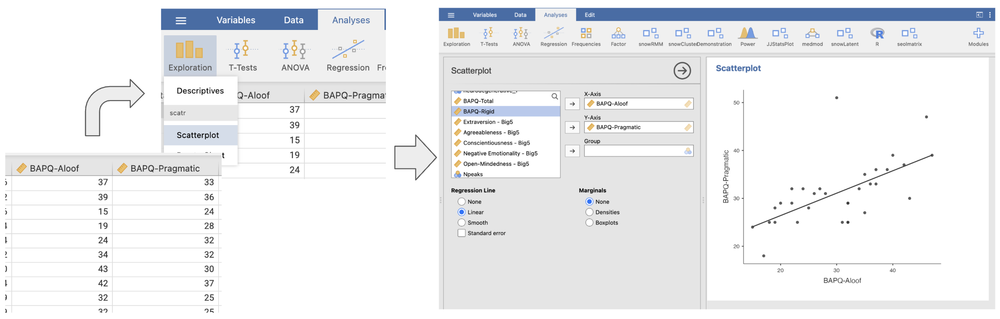
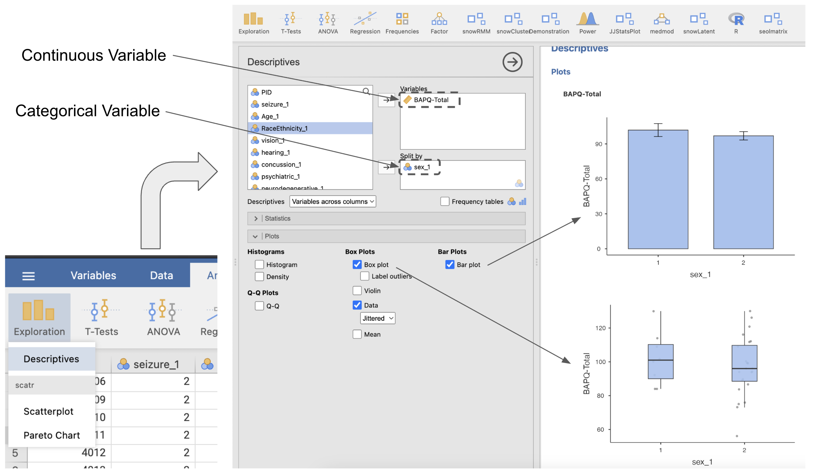
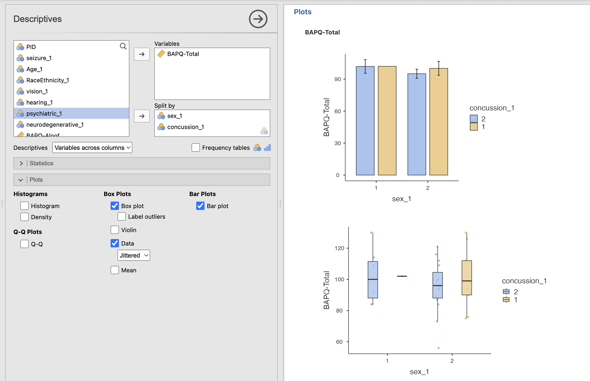
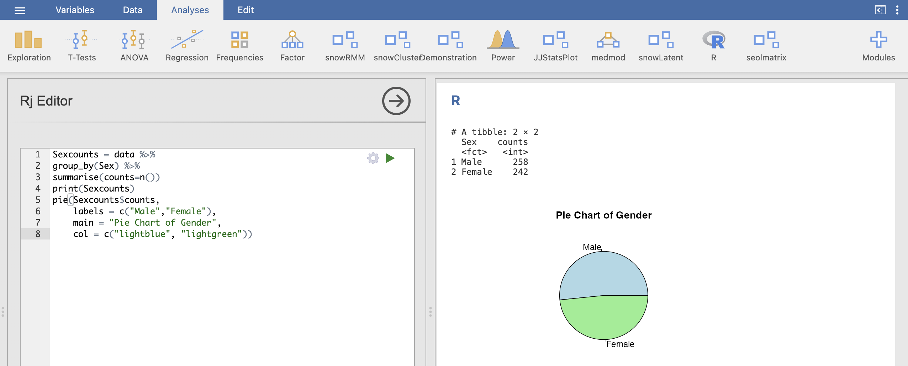
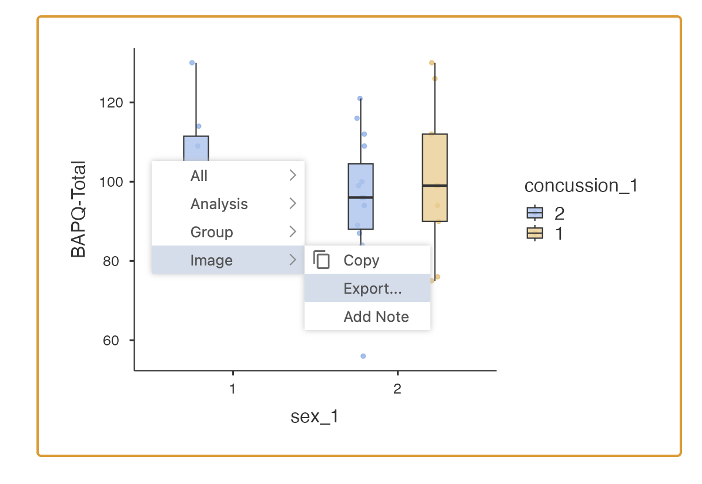
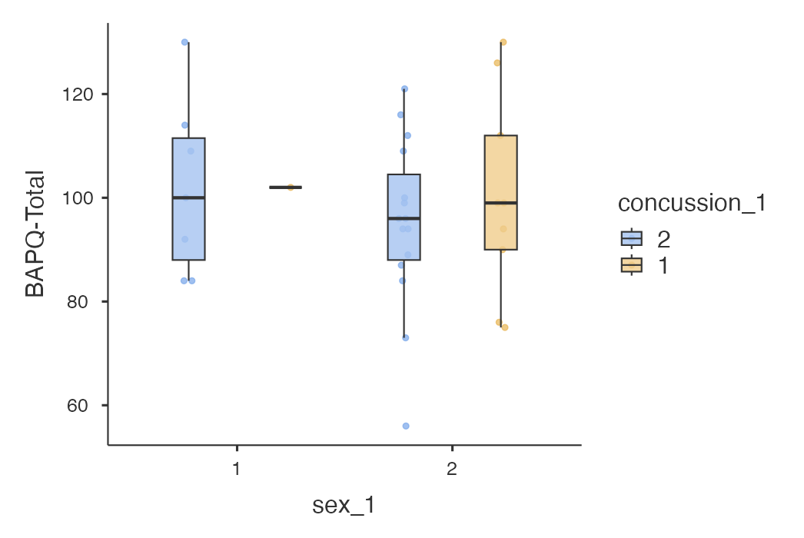
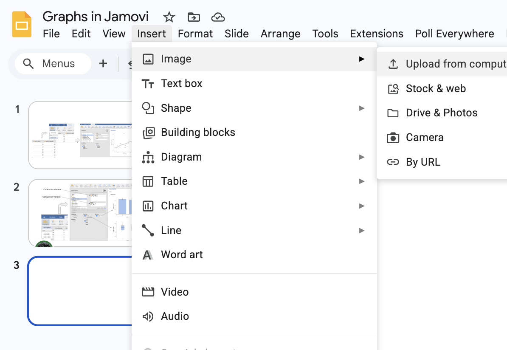
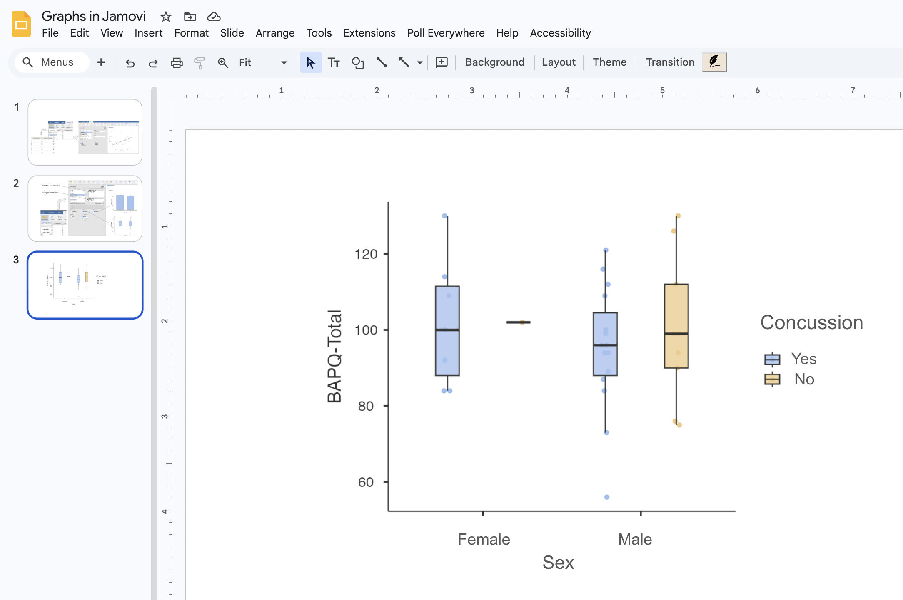

```{r setup, include=FALSE}
knitr::opts_chunk$set(echo = TRUE, warning = FALSE, message = FALSE, fig.height = 4, fig.width = 6, fig.align = 'center')
library(tidyverse)
```

---

## Why Do We Need to Visualize Data?

> "Graphs are not just decorative. They are tools for reasoning about data."

> - **The Goal**: Represent data clearly, revealing distributions, differences, outliers, and trends.
> - The Challenge: Moving from raw numbers to interpretation.
> - Before graphing, ask:<br>
What kind of variables am I trying to represent?<br>
What pattern do I want the reader to see?

---


## Choosing the Right Graph

Match your graph to your **data type** and **research question**:

- **Categorical Variables:**
  - **Pie Chart:** Parts of a whole (use sparingly).
  - **Column Chart:** Comparing counts, proportions, or descriptive statistics across categories.
- **Continuous Variables:**
  - **Histogram:** Distribution of one numeric variable.
  - **Boxplot:** Comparing distributions across groups.
  - **Line Chart:** Trends across ordered values (especially time).
  - **Scatterplot:** Relationships between two continuous variables.

---

## Histograms

**When to Use:**
- Examining the distribution of one continuous variable.
- Checking for symmetry, skew, multimodality, or gaps.

**When NOT to Use:**
- Categorical variables.
- Comparing a large number of groups.

```{r, echo=FALSE, fig.height=3}
ggplot(mpg, aes(x = hwy)) +
  geom_histogram(binwidth = 2, fill = "darkgreen", color = "white") +
  labs(title = "Distribution of Highway Mileage", x = "MPG", y = "Frequency") +
  theme_bw()
```

---

## Pie Charts

**When to Use:**
- Categorical variables.
- Small number of categories.
- Goal is to emphasize relative proportions (parts of a whole).

**When NOT to Use:**
- Many categories (becomes unreadable).
- Categories have very similar proportions (angles are hard to compare).

```{r, echo=FALSE, fig.height=3.5}
study_pref <- tibble(
  environment = c("Library", "Dorm", "Coffee Shop", "Outside"),
  count = c(18, 10, 7, 5)
)

ggplot(study_pref, aes(x = "", y = count, fill = environment)) +
  geom_col(width = 1) +
  coord_polar(theta = "y") +
  labs(title = "Preferred Study Environment") +
  theme_void()
```

---

## Scatterplots

**When to Use:**
- Both variables are quantitative/continuous.
- Examining associations (direction, strength, and form).

**When NOT to Use:**
- When variables are categorical.

```{r, echo=FALSE,fig.height=3}
ggplot(mtcars, aes(x = wt, y = mpg)) +
  geom_point(size = 2) +
  geom_smooth(method = "lm", se = FALSE, color = "red") +
  labs(title = "Car Weight vs. Fuel Efficiency", x = "Weight (1000 lbs)", y = "MPG") +
  theme_bw()
```

---


## Column Charts

**When to Use:**
- Comparing counts or means across discrete categories.

**When NOT to Use:**
- Showing the shape of a continuous distribution.
- Showing relationships between two continuous variables.

```{r, echo=FALSE,fig.height=3}
major_counts <- tibble(
  major = c("Psychology", "Biology", "Business", "Engineering"),
  count = c(24, 16, 12, 8)
)

ggplot(major_counts, aes(x = major, y = count)) +
  geom_col(fill = "steelblue") +
  labs(title = "Number of Students by Major", x = "Major", y = "Count") +
  theme_bw()
```

---


## Boxplots

**When to Use:**
- Comparing the distribution of a continuous variable across groups.
- Showing center (median), spread (IQR), and outliers compactly.

**When NOT to Use:**
- When the exact shape/detail of the distribution is necessary.
- Very small sample sizes.

```{r, echo=FALSE,fig.height=3}
ggplot(ToothGrowth, aes(x = supp, y = len, fill = supp)) +
  geom_boxplot() +
  labs(title = "Tooth Length by Supplement Type", x = "Supplement", y = "Length") +
  theme_bw() + theme(legend.position = "none")
```

---

## APA-Style Figures

When presenting results, figures must be clear, professional, and disciplinary-consistent.

**Hallmarks of an APA-Style Figure:**
- Simple, readable fonts and clear axis labels.
- No unnecessary background effects or 3D decoration.
- Minimal visual clutter (prefer `theme_classic()`).
- Informative captions explaining the variables and error bars.

> **Rule of Thumb:** Prefer clarity over visual flair. If it prints well in grayscale, it's usually a good start.

---

## Error Bars: Showing Uncertainty

When graphing a group mean, the mean is only a summary. **Error bars** represent uncertainty or variability. 

**Types of Error Bars:**
1. **Standard Deviation (SD):** Shows how spread out individual observations are.
2. **Standard Error (SE):** Shows how precisely the sample mean estimates the population mean.
3. **Confidence Interval (CI):** Gives a range of plausible values for the population parameter.

*Warning: Always explicitly state what your error bars represent in your figure caption!*

---

## Error Bars - Column Chart

Point plots are often preferred over bar charts for showing means, as they emphasize the estimate rather than the raw total.

```{r, echo=FALSE,fig.height=3}
# Compute 95% CI (Mean +/- 1.96 * SE)
tooth_summary <- ToothGrowth %>%
  group_by(supp) %>%
  summarise(
    n = n(), mean_len = mean(len), sd_len = sd(len),
    se_len = sd_len / sqrt(n),
    ci_lower = mean_len - 1.96 * se_len, ci_upper = mean_len + 1.96 * se_len,
    .groups = "drop"
  )

ggplot(tooth_summary, aes(x = supp, y = mean_len)) +
  geom_col() +
  geom_errorbar(aes(ymin = ci_lower, ymax = ci_upper), width = 0.1) +
  labs(x = "Supplement Type", y = "Mean Tooth Length") +
  theme_classic(base_size = 14)
```

---

## Error Bars - Point Plot

Point plots are often preferred over bar charts for showing means, as they emphasize the estimate rather than the raw total.

```{r, echo=FALSE,fig.height=3}
# Compute 95% CI (Mean +/- 1.96 * SE)
tooth_summary <- ToothGrowth %>%
  group_by(supp) %>%
  summarise(
    n = n(), mean_len = mean(len), sd_len = sd(len),
    se_len = sd_len / sqrt(n),
    ci_lower = mean_len - 1.96 * se_len, ci_upper = mean_len + 1.96 * se_len,
    .groups = "drop"
  )

ggplot(tooth_summary, aes(x = supp, y = mean_len)) +
  geom_point(size=3) +
  geom_errorbar(aes(ymin = ci_lower, ymax = ci_upper), width = 0.1) +
  labs(x = "Supplement Type", y = "Mean Tooth Length") +
  theme_classic(base_size = 14)
```

---

## Line Charts

**When to Use:**
- X-axis is logically ordered (e.g., Time).
- Highlighting trends, trajectories, or repeated measurements.

**When NOT to Use:**
- Unordered categories (e.g., comparing Biology to Psychology).

```{r, echo=FALSE,fig.height=3}
stress_time <- tibble(week = 1:6, mean_stress = c(3.2, 3.8, 4.1, 4.5, 5.0, 4.4))

ggplot(stress_time, aes(x = week, y = mean_stress)) +
  geom_line(color = "blue", size = 1) +
  geom_point(size = 3) +
  labs(title = "Average Stress Across Six Weeks", x = "Week", y = "Stress Rating") +
  theme_bw()
```

---

## Line Charts: Multiple Groups & Error Bars

**When to Use:**
- You have an ordered sequence (like time) on the x-axis.
- You are comparing **two or more groups** across that sequence.
- You need to show both the trend (the line) and the uncertainty (the error bars).

*Crucial R Tip:* To draw separate lines for each group, you must tell `ggplot2` to group the data using `group = your_category_variable` inside the `aes()` function!

```{r, echo=FALSE,fig.height=3.5}
# Creating a summarized dataset of symptom scores over 4 weeks
treatment_summary <- tibble(
  week = rep(1:4, times = 2),
  condition = rep(c("Control", "Treatment"), each = 4),
  mean_score = c(40, 42, 41, 43,   # Control stays high
                 40, 32, 25, 18),  # Treatment drops
  se = c(2.1, 2.5, 2.3, 2.8,       # Standard Errors
         2.0, 2.2, 1.9, 1.7)
)

ggplot(treatment_summary, aes(x = week, y = mean_score, color = condition, group = condition)) +
  geom_line(size = 1) +
  geom_point(size = 3) +
  geom_errorbar(aes(ymin = mean_score - se, ymax = mean_score + se), width = 0.1, size = 0.7) +
  labs(
    title = "Symptom Severity Over 4 Weeks", 
    x = "Week", 
    y = "Mean Symptom Score", 
    color = "Condition"
  ) +
  theme_classic(base_size = 14)
```

---


## Common Mistakes to Avoid

1. **Pie chart overload:** Using a pie chart for too many categories hides small differences.
2. **Categorical continuous data:** Using a column chart for a continuous distribution (use a histogram instead).
3. **False continuity:** Using a line chart for unordered categories.
4. **Hiding the spread:** Using a chart of means when variability/skew heavily impacts the interpretation (use a boxplot instead).
5. **Chart junk:** Adding 3D effects, heavy gridlines, or excessive colors that distract from the data.

---

## Final Takeaway

> "Plots and graphs are not just decorative. They are tools for reasoning about data."

Ask yourself **"What relationship, pattern, or comparison am I trying to show?"** That question will usually point you to the correct graph.


---

# Making Graphs in Jamovi

Many plots/graphs can be generated directly from the Jamovi menus and/or within the options of the analysis you are using.

When Jamovi lacks the option to make a plot/graph, you can use the RjEditor plugin.


---

# Scatterplots in Jamovi

1. Identify two continuous variables
2. Select `Explore > Scatterplot` 
3. Add your variables to the X and Y axis fields
4. Select options as desired

<div style="text-align: center;">
  
</div>


---

# Boxplots/Bar plots/Histograms in Jamovi

1. One continuous variable summarized across levels of a categorical (grouping) variable
2. Select `Explore > Descriptives` 
3. Add your continuous variable to the "Variables" field
4. Add your categorical variable to the "Split-by" field
5. Select options as desired

**NOTE:** Error bars represent the 95% confidence interval around the mean.

<div style="text-align: center;">
  
</div>

---

# Grouped Boxplots/Bar plots in Jamovi

1. You can create grouped bar charts and boxplots by adding more categorical variables to the "Split-by" field


<div style="text-align: center;">
  
</div>

---

# Pie Charts

- No point-and-click option
- However......You can use the `RjEditor` add-on module and a few lines of R code.

<div style="text-align: center;">
  
</div>

# Exporting Figures

1. When you are ready to put figures from Jamovi into your document, you should export a copy to a directory on your computer.
2. right-click > image > export


<div style="text-align: center;">
  
</div>

**Choose .png as file type when saving**

---

# Cleaning Up Jamovi Figures

1. Notice that the figures in Jamovi may not have appealing axis and/or tick labels.

<div style="text-align: center;">
  
</div>


---

# Editing Figures

- Jamovi Graphs/Plots can be easily manipulated in many different programs
- I use Google Slides!


<div style="text-align: center;">
  
</div>


---

# Clean Figure

1. Use text boxes to cover up unsightly Jamovi labels.

<div style="text-align: center;">
  
</div>
