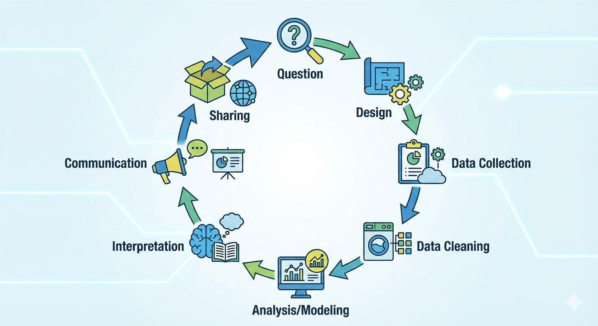
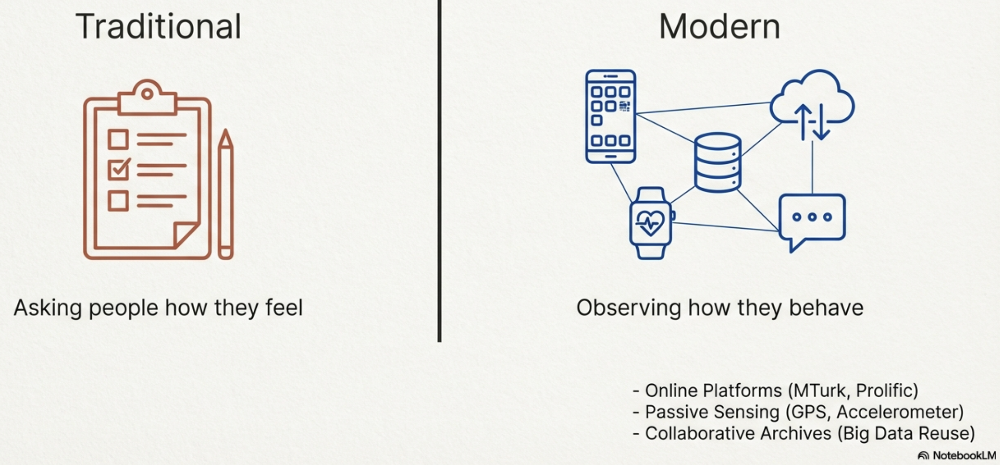
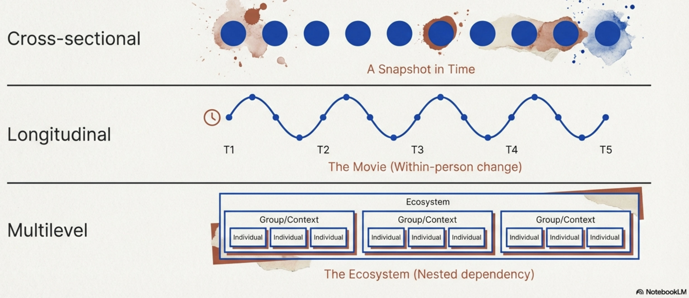
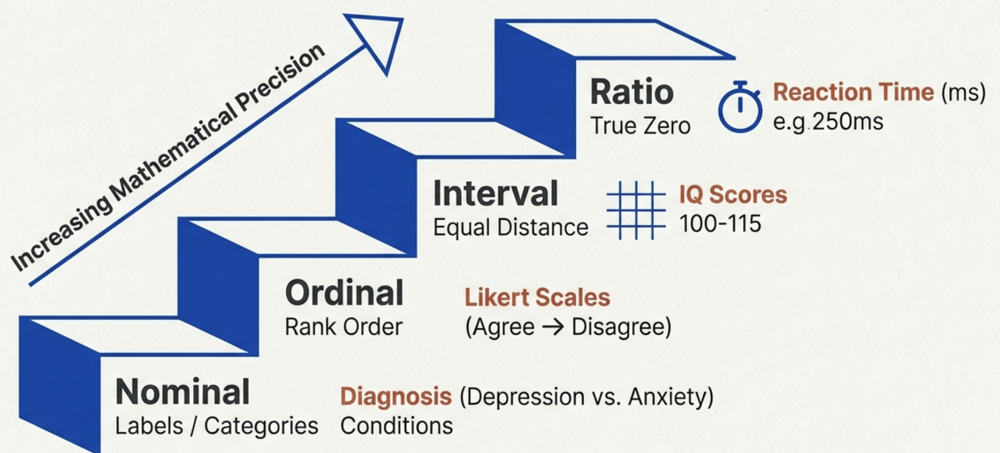
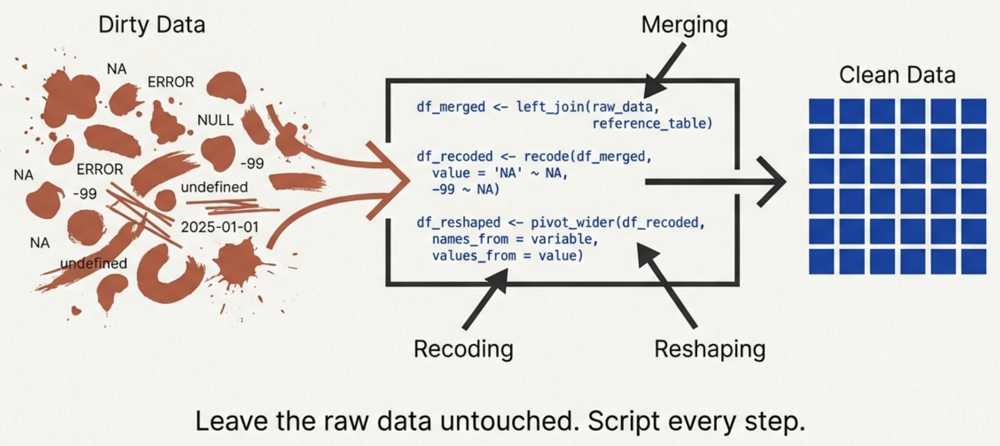
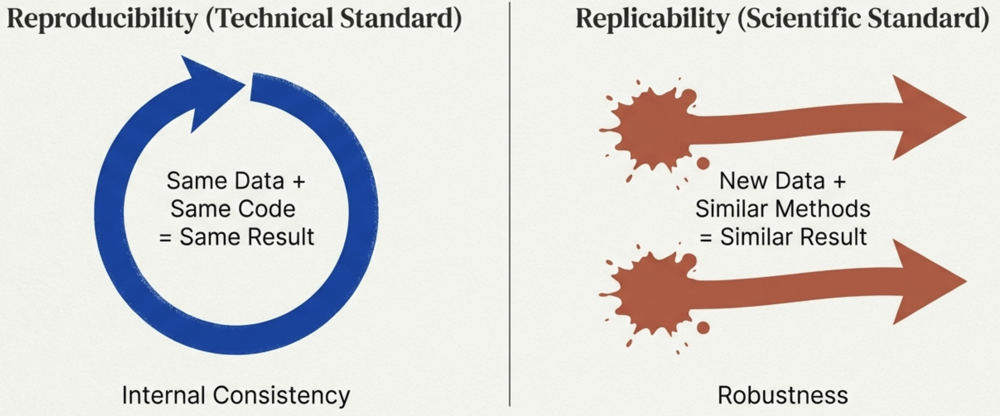
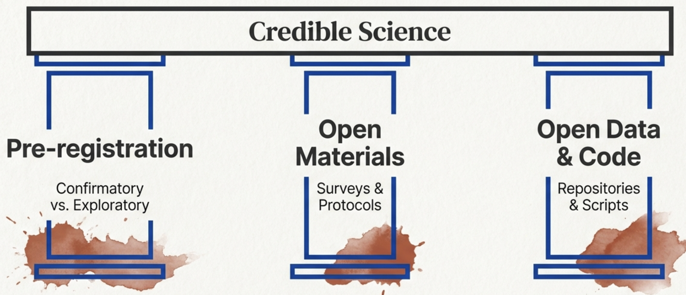

```{r setup, include=FALSE}
# This chunk sets up the R environment for the rest of the document
knitr::opts_chunk$set(
  echo = TRUE,       # Show the R code
  message = FALSE,   # Hide messages
  warning = FALSE,   # Hide warnings
  fig.align = "center", # Center plots
  out.width = '70%'
)

# Load required libraries
library(tidyverse) # For ggplot2, dplyr, and more
library(broom)     # For tidying model output
library(lme4)      # For Linear Mixed Models (LMM)
library(lmerTest)  # For p-values in LMMs
library(car)       # For Anova()
library(lattice)   # For qqmath()
```

---
title: "Introduction to Data Science"
subtitle: "Workflow, Data Types, and Open Science"
author: "Paul Kieffaber"
date: "`r Sys.Date()`"
output: 
  slidy_presentation:
    footer: "Introduction to Data Science for the Psychological Sciences"
    highlight: pygments
---

## Defining Data Science in Psychology

* Data science is not just a single statistical test; it is a systematic sequence of steps.
* It provides a framework to make research decisions explicit and transparent.
* The goal is to produce results that are **interpretable, credible, and useful** to the scientific community.

```{r, echo=FALSE, out.width="70%", fig.align="center"}

```

---

## The Data Science Workflow

* The workflow is a cycle: **Question → Design → Data Collection → Data Cleaning → Analysis/Modeling → Interpretation → Communication → Sharing.**
* Each "arrow" in the workflow represents a critical decision point for the researcher.
* Seeing research as a workflow helps manage complexity and ensures reproducibility.

```{r, echo=FALSE, out.width="60%", fig.align="center"}

```


---

## Formulating the Research Question

* Everything begins with a question about human behavior, cognition, or emotion.
* Examples: 
    * "Do rewards lead to faster learning than punishments?" 
    * "How does stress affect teen mood?"
    * "Which factors are most important in determining successful foster placement?"
* A clear, theoretically grounded question is the foundation of the entire workflow.

---

## Research Design and Collection

* **Design:** Choosing how to structure the study to best answer the question.
* **Collection:** Gathering raw data. 
* Modern psychology sources: 
    * Digital diaries
    * EEG recordings or fMRI scans
    * Clinical records
    * Survey results
    * Epidemiological data
* The quality of the design and data collection determines the ultimate value of the findings.

---

## The "Heavy Lifting" - Data Cleaning

* Data cleaning is often the most time-consuming phase of a project.
* It involves handling missing values, fixing formatting errors, and preparing raw data for software.
* Proper cleaning is essential for the **credibility** of the final analysis.

```{r, echo=FALSE, out.width="70%", fig.align="center"}

```

---

## Analysis and Modeling

* This phase moves the project from "raw numbers" to "statistical relationships."
* It involves selecting the appropriate model to represent the psychological phenomenon.
* Modeling aims to simplify complex data into understandable patterns.
  * General Linear Model (t-test, ANOVA, regression, etc.)
  * Cluster Analyses / Machine Learning

---

## Interpretation and Communication

<div style="float:left; width:40%;">
<ul>
<li><b>Interpretation:</b> Determining what the statistical results mean in a real-world psychological context.</li>
<li><b>Communication:</b> Presenting findings through posters, talks, or peer-reviewed manuscripts.</li>
<li>Clear communication allows other scientists to critique and build upon your work.</li>
</ul>
</div>

<div style="float:right; width:58%;">
```{r echo=FALSE, out.width="100%"}

```
</div> <div style="clear:both;"></div>

---

## The Importance of Sharing

* The final step of the workflow is making data and materials available to others.
* Sharing is a core tenet of **Open Science**, allowing for independent verification.
* It promotes replicability in science.
* It ensures that the knowledge gained becomes a permanent part of the scientific record.

---

<div style="display:flex; align-items:center; justify-content:center; height:90vh; font-size:34px; font-weight:700;">
Units of Analysis and Types of Data
</div>

---

## Determining the Unit of Analysis

* The "unit of analysis" is the major entity that you are analyzing in your study.
* Common units in psychology:
    * Single trials
    * The individual
    * A couple
    * A classroom
* Identifying this unit is the first step in organizing and structuring a dataset.

---

## Shapes of Data

```{r, echo=FALSE, out.width="90%", fig.align="center"}

```

---

## Cross-Sectional Data

* Data collected from participants at a **single point in time**.
* This provides a "snapshot" of a population (e.g., a one-time survey).
* Useful for looking at relationships between variables as they exist right now.

---

## Longitudinal Data

* Data collected from the same participants **repeatedly over time**.
* Essential for studying:
    * Development and aging
    * Fluctuations in mood or behavior
* Allows researchers to see how individuals change over time.

---

## Multilevel Data

* Data that is "nested" within higher-level groups.
* Examples: 
    * Students nested within schools
    * Daily measurements nested within a single person
* Understanding nesting is crucial for accurate statistical modeling in psychology.

---

<div style="display:flex; align-items:center; justify-content:center; height:90vh; font-size:34px; font-weight:700;">
Data Scales (Resolution)
</div>

---

## Nominal and Ordinal Scales

* **Nominal:** Categorical labels with no inherent order (e.g., Gender, Nationality).
* **Ordinal:** Categories with a logical rank but unequal distances between them (e.g., 1st, 2nd, and 3rd place in a race).


---

## Interval and Ratio Scales

* **Interval:** Numerical scales with equal distances between units but no "true zero" (e.g., IQ scores, Temperature).
* **Ratio:** Numerical scales with equal distances **and** a true zero (e.g., Number of traumatic experiences).
* The scale type determines which statistical tests are valid to use.

```{r, echo=FALSE, out.width="75%", fig.align="center"}

```

---

## From Raw Data to Finished Product

* In textbooks, datasets often appear as neat tables with no missing values and no inconsistencies.
* The reality if much different!
  * Data from several sources in different formats
  * Missing data
  * Miscoded data (e.g., Male, M, Mal)
  * Inconsistent formats (e.g., 12/25/25, 12.25.25, December-25-2025)
* The goal is not to master every cleaning technique, but to recognize
that raw data are never ready for modeling and that data preparation is a crucial, non-trivial part
of psychological science.

---

## The Advantage of Scripting (R/Python)

* Moving from "point-and-click" (like SPSS) to scripts improves transparency of the data science process.
* A script is a permanent, step-by-step record of every decision made during **cleaning** and **analysis**.
* Scripts make it easy for others to understand exactly what was done and **reproduce** it.

```{r, echo=FALSE, out.width="75%", fig.align="center"}

```

---

## Defining Reproducibility

* **Reproducibility** occurs when a different researcher uses your **original data and code** and arrives at the same result.
* It is a test of whether your analysis was conducted and documented correctly.
* High reproducibility is a hallmark of transparent science.

---

## Defining Replicability

* **Replicability** occurs when a researcher uses **new data** but the **same methods** and finds the same effect.
* It tests whether a psychological finding is robust or just a "one-time" fluke.

```{r, echo=FALSE, out.width="75%", fig.align="center"}

```

---

## The Replication Crisis

* Large-scale efforts to repeat classic studies have sometimes failed to find the reported effects, or have found them to be much smaller than originally claimed. These patterns have raised questions about how psychological results are produced, analyzed, and reported.
* **p-hacking**
  * **Analytic flexibility** and **Researcher Degrees of Freedom**

---

## Open Science

* Open Science is a set of practices aimed at making the research process—its inputs, procedures, and outputs—more accessible, transparent, and reusable.

```{r, echo=FALSE, out.width="75%", fig.align="center"}

```

---

## Ethics and Privacy in Data Science

* Psychological data often contains sensitive clinical or personal information.
* Researchers have an ethical obligation to protect participant privacy when sharing data.
* Includes "de-identifying" datasets before they are made public.

---

## Summary: The Path to Credible Science

* Data science is a systematic workflow that emphasizes transparency.
* Understanding data types, measurement scales, and scripting leads to robust findings.
* The ultimate goal is a more open, reproducible, and credible psychological science.
