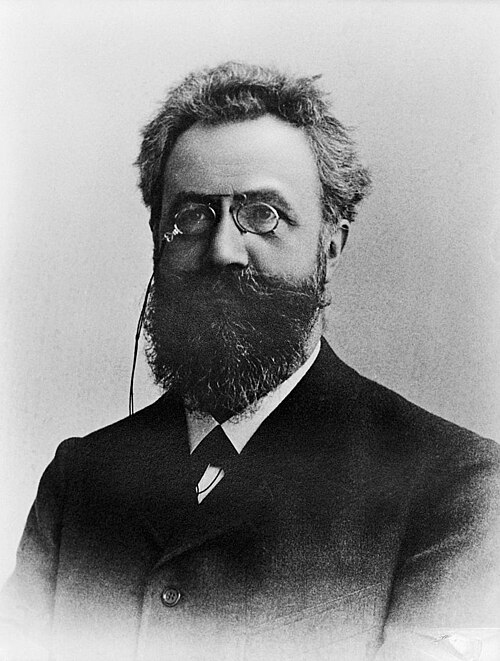
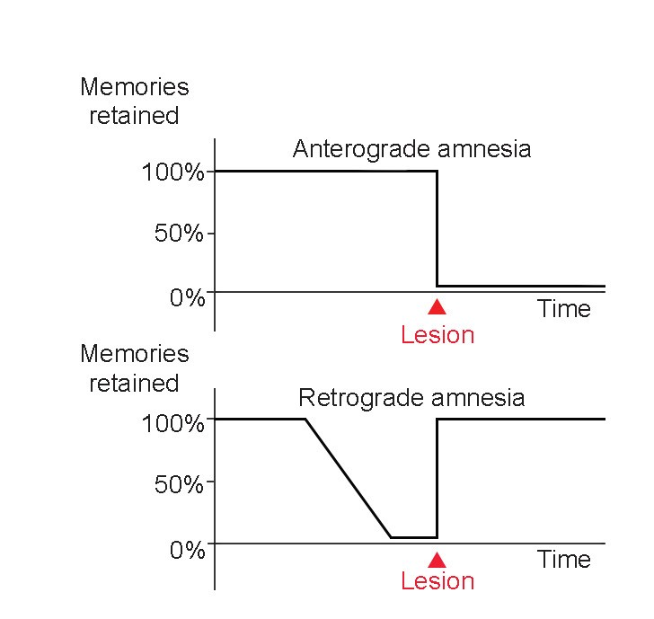
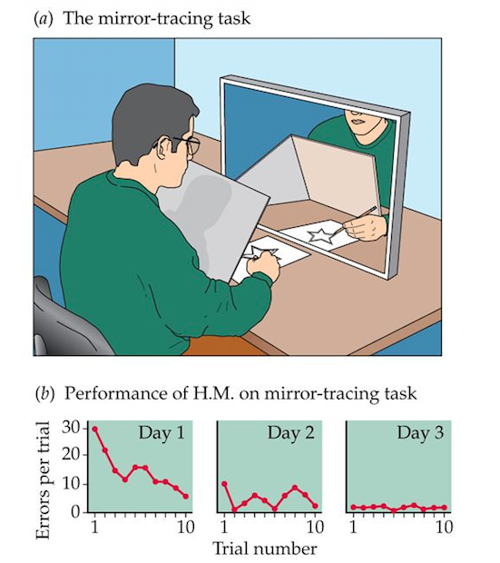
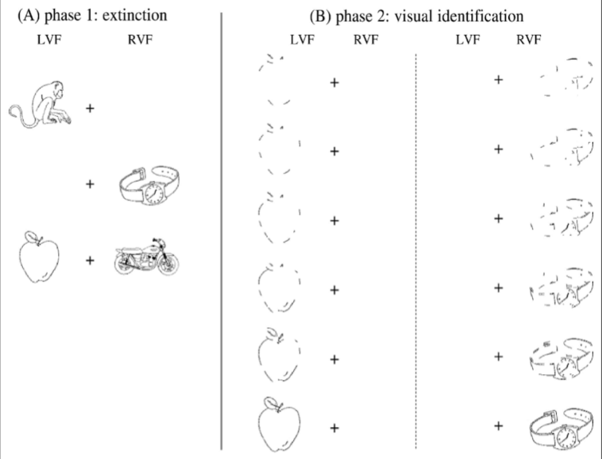
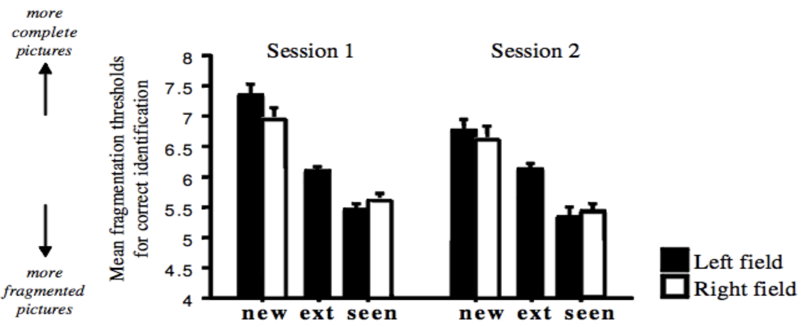

```{r setup, include=FALSE}
knitr::opts_chunk$set(
  echo = FALSE,
  warning = FALSE,
  message = FALSE,
  fig.align = 'center',
  fig.retina = 2
)

library(tidyverse)
library(DiagrammeR)
library(htmltools)

# Global plot theme matching the template
theme_lecture <- function(base_size = 12, base_family = "") {
  theme_minimal(base_size = base_size, base_family = base_family) +
    theme(
      plot.title = element_text(size = base_size * 1.2, face = "bold", color = "#173F5F"),
      plot.subtitle = element_text(size = base_size * 0.95),
      plot.caption = element_text(size = base_size * 0.75),
      axis.title = element_text(size = base_size * 0.95, face = "bold"),
      axis.text = element_text(size = base_size * 0.8),
      legend.title = element_text(size = base_size * 0.9, face = "bold"),
      legend.text = element_text(size = base_size * 0.8),
      strip.text = element_text(size = base_size * 0.9, face = "bold"),
      panel.grid.minor = element_blank()
    )
}
theme_set(theme_lecture(base_size = 18))
```

```{r styles, results='asis', echo=FALSE}
cat('
<style>
body {
  font-family: "Helvetica Neue", Arial, sans-serif;
}

h1.title {
  color: #173F5F;
}

h2, h3 {
  color: #173F5F;
}

.slide {
  background: #FAFCFE;
}

.inverse {
  background: linear-gradient(135deg, #173F5F 0%, #20639B 100%);
  color: white;
}

.inverse h1, .inverse h2, .inverse h3, .inverse p, .inverse li {
  color: white !important;
}

.section-tag {
  display: inline-block;
  padding: 6px 12px;
  border-radius: 999px;
  background: #EAF2F8;
  color: #20639B;
  font-size: 18px;
  font-weight: 700;
  letter-spacing: 0.03em;
  margin-bottom: 12px;
}

.note-box {
  background: #FDF2E9;
  border-left: 8px solid #F39C12;
  padding: 14px 18px;
  border-radius: 8px;
  margin-top: 14px;
}

.takeaway-box {
  background: #EBF5FB;
  border-left: 8px solid #2E86C1;
  padding: 14px 18px;
  border-radius: 8px;
  margin-top: 14px;
}

.small {
  font-size: 0.78em;
}

.center {
  text-align: center;
}

.two-col {
  display: grid;
  grid-template-columns: 1fr 1fr;
  gap: 28px;
  align-items: start;
}

.left-col {
  font-size: 0.95em;
}

.right-col {
  text-align: center;
}

.slide ul, .slide ol {
  margin-top: 0.5em;
  margin-bottom: 0.5em;
  padding-left: 1.1em;
}

.slide li {
  margin-top: 0.3em;
  margin-bottom: 0.3em;
  line-height: 1.1;
}

/* Add a new one for wider text columns */
.two-col-wide-left {
  display: grid;
  grid-template-columns: 70% 30%;
  gap: 28px;
  align-items: start;
}

.three-col {
  display: grid;
  grid-template-columns: 1fr 1fr 1fr;
  gap: 20px;
  align-items: start;
  margin-top: 40px;
}
</style>
')
```

---

# The Origins of Memory Research

<div class="section-tag">Historical Context</div>

<div class="two-col">

<div class="left-col">
- The experimental study of memory dates back to the 1880s with the publication of Hermann Ebbinghaus' research.
- Ebbinghaus was the first to believe that rigorous experimental methods could be applied to "higher" cognitive functions.

<div class="note-box">
**Neuroanatomical Milestones:** Around this exact same time (1873-1887), Camillo Golgi developed the "Golgi stain" and Ramón y Cajal first observed individual neurons. 
</div>
</div>

<div class="right-col">
<br>

<p class="small">Hermann Ebbinghaus (1850–1909)</p>
</div>

</div>


# Measuring Memory: The Ebbinghaus Tradition

## Methodology:

<div class="two-col-wide-left">

<div class="left-col">
He was the only subject in all of his research

Used lists of “CVC nonsense syllables”

1) Read the list aloud, cover it up, and try to recall.

2) Measure "trials to criterion" (attempts to recite perfectly).

3) Wait a specific retention interval, then relearn the list.

4) The Savings Score: ((Original Learning - Relearning) / Original Learning) * 100

</div>
<div class="left-col">
ZOC

VAP

TOK

BUP

KET

ZOD
</div>
</div>

```{r forgetting-curve, out.width='70%', fig.align='center' }
# Simulated Ebbinghaus Data
ebb_dat <- tibble(
  Time = c(0.1, 0.33, 1, 8.8, 24, 48, 144, 744),
  Savings = c(100, 58.2, 44.2, 35.8, 33.7, 27.8, 25.4, 21.1)
)
ggplot(ebb_dat, aes(x = Time, y = Savings)) +
geom_line(color = "#20639B", size = 1.2) +
geom_point(color = "#ED553B", size = 4) +
scale_x_log10(breaks = c(0.1, 1, 10, 100, 700), labels = c("0", "1 hr", "10 hr", "100 hr", "1 mo")) +
labs(
title = "The Forgetting Curve",
subtitle = "Forgetting is rapid at first, then levels off",
x = "Retention Interval (Log Scale)",
y = "Percent Savings (%)"
) +
coord_cartesian(ylim = c(0, 100))
```
He noted that the forgetting curve was not linear, but declined rapidly over the first hour, then gradually over subsequent retention intervals.


# The Information Processing Model {.inverse}

<div class="section-tag">Three Distinct Stages</div>

Note that Ebbinghaus' approach relied on a fairly simplistic definition of memory - how long things last.

Modern experimental psychology conceptualizes memory as moving through three information processing stages. 

<br>

<table width="100%" style="border: none; box-shadow: none; background: transparent;">
  <tr style="background: transparent;">
  
    <td width="33%" style="vertical-align: top; border: none; padding-right: 20px;">
      <h3 style="color: white; margin-top: 0;">1. Encoding</h3>
      <p style="font-size: 0.9em; line-height: 1.4;">The process of taking incoming sensory information and converting it into a form that the brain can process and store. <br><br><em>(Studied by manipulating how people study).</em></p>
    </td>
    
    <td width="33%" style="vertical-align: top; border: none; padding-right: 20px;">
      <h3 style="color: white; margin-top: 0;">2. Storage</h3>
      <p style="font-size: 0.9em; line-height: 1.4;">The passive or active maintenance of information over time. <br><br><em>(Studied by manipulating retention intervals or introducing interference).</em></p>
    </td>
    
    <td width="33%" style="vertical-align: top; border: none;">
      <h3 style="color: white; margin-top: 0;">3. Retrieval</h3>
      <p style="font-size: 0.9em; line-height: 1.4;">The process of accessing and bringing stored information back into conscious awareness. <br><br><em>(Studied by manipulating how memory is tested).</em></p>
    </td>
    
  </tr>
</table>

# Traditional Methods: Studying Encoding

<div class="section-tag">Manipulating the Study Phase</div>

How does the way we interact with information at the time of learning dictate what is actually stored? Researchers manipulate study conditions to find out.

<div class="two-col">

<div class="left-col">
### Levels of Processing
*Craik & Lockhart (1972)* proposed that memory relies on the "depth" of attention paid to stimuli during study:

- **Graphemic:** Physical features *(e.g., Is the word in uppercase?)*
- **Phonemic:** Acoustic features *(e.g., Does it rhyme with chair?)*
- **Semantic:** Meaning-based *(e.g., Is it a living thing?)*

<div class="note-box">
**Critique:** The theory risks tautology. We say a word was processed deeply because it was remembered well, but explain that it was remembered well because it was processed deeply.
</div>
</div>

<div class="right-col">
### Robust Encoding Phenomena

- **The Generation Effect:** Actively producing a target word (e.g., generating *cold* from the cue `hot - c___`) leads to significantly stronger memory than passively reading the complete pair.
- **The Self-Reference Effect:** Evaluating stimuli based on how well they describe *you personally* yields even deeper encoding and better recall than standard semantic processing.
</div>

</div>

# Traditional Methods: Studying Storage

<div class="section-tag">Preventing Rehearsal</div>

How is information maintained in short-term memory, and how do we lose it? To isolate "storage" as a variable, researchers must prevent the subject from actively rehearsing the information.

<div class="two-col">

<div class="left-col">
### The Brown-Peterson Task
Designed in the late 1950s, this task measures the duration of short-term memory by blocking the articulatory loop.

- **Stimulus:** Present a consonant trigram (e.g., `C H J`).
- **Distractor Task:** Immediately present a random 3-digit number (e.g., `506`) and ask the subject to count backward by 3s aloud.
- **Delay:** Vary the retention interval (usually 0 to 18 seconds).
- **Test:** Ask the subject to recall the trigram.
</div>

<div class="right-col">
<br>
<div class="takeaway-box">
**What does this measure?** <br>
By occupying the mind with a demanding math task, researchers initially believed they were measuring the pure **decay** of a memory trace over time. Later research revealed they were actually measuring **interference**.
</div>
</div>

</div>

# Class Demonstration

<div class="section-tag">Experiencing the Paradigm</div>

<div class="center" style="margin-top: 60px;">
### Instructions

<div style="display: inline-block; text-align: left; font-size: 1.2em; line-height: 1.8;">
1. You will see three consonants appear on the screen. <br>
2. Immediately after, a number will appear. <br>
3. **Start counting backward by 3s ALOUD from that number.** <br>
4. When the screen says **"RECALL"**, write down the three letters.
</div>
</div>

# Trial 1 Stimulus {.inverse}

<div class="center" style="margin-top: 80px;">
<h1 style="font-size: 5em; letter-spacing: 0.2em; margin-bottom: 40px;">F Z M</h1>
</div>

# Trial 1 Interference {.inverse}

<div class="center" style="margin-top: 80px;">
<h1 style="font-size: 4em; color: #F39C12;">8 4 1</h1>
</div>

# Trial 2 Stimulus {.inverse}

<div class="center" style="margin-top: 80px;">
<h1 style="font-size: 5em; letter-spacing: 0.2em; margin-bottom: 40px;">P C S</h1>
</div>

# Trial 2 Interference {.inverse}

<div class="center" style="margin-top: 80px;">
<h1 style="font-size: 4em; color: #F39C12;">7 8 4</h1>
</div>

# The Results: Interference

<div class="section-tag">Why does it get harder?</div>

<div class="two-col">

<div class="left-col">
If we did multiple trials, you would likely find the first trial relatively easy, but the 4th or 5th trial extremely difficult. Why?

**Proactive Interference (Keppel & Underwood, 1962):**
- Old information (previous trials) interferes with the ability to store and retrieve new information (the current trial).
- Without rehearsal, the memory trace becomes highly susceptible to this interference. 

<div class="takeaway-box">
If we suddenly switched the stimulus from letters to shapes, your memory would immediately bounce back to near 100%!
</div>
</div>

<div class="right-col">
```{r bp-plot, out.width='100%', fig.align='center'}
# Simulated data based on Keppel & Underwood (1962)
bp_dat <- tibble(
  Delay = rep(c(3, 6, 9, 12, 15, 18), 2),
  Trial_Type = rep(c("Trial 1", "Trial 4"), each = 6),
  Accuracy = c(95, 92, 88, 85, 80, 78,   # Trial 1 (High accuracy, little PI)
               65, 40, 25, 15, 10, 8)    # Trial 4 (High PI)
)

ggplot(bp_dat, aes(x = Delay, y = Accuracy, color = Trial_Type, group = Trial_Type)) +
  geom_line(size = 1.5) +
  geom_point(size = 4) +
  scale_color_manual(values = c("#3CAEA3", "#ED553B")) +
  labs(
    title = "Proactive Interference in STM",
    subtitle = "Forgetting accelerates on later trials",
    x = "Retention Interval (seconds)",
    y = "Percent Correct (%)",
    color = "Condition"
  ) +
  coord_cartesian(ylim = c(0, 100)) +
  theme(legend.position = "top")
```
</div>
</div>

# Stop and Think {.inverse}

<div class="section-tag">Methodological Critique</div>

<div class="two-col" style="margin-top: 50px;">

<div class="left-col">
<h3 style="color: white; border-bottom: 2px solid white; padding-bottom: 10px;">Internal Validity?</h3>
- Are we truly isolating the specific memory process we claim to be studying?
- Did the independent variable *actually* cause the change in the dependent variable, or was there a confounding factor (like fatigue or guessing)?
</div>

<div class="right-col">
<h3 style="color: white; border-bottom: 2px solid white; padding-bottom: 10px;">External Validity?</h3>
- How artificial is the laboratory paradigm?
- To what situations, populations, stimuli, etc. does this result generalize?
- Does learning a list of CVC nonsense syllables predict how well you will remember a face or a textbook chapter?
</div>

</div>


# Traditional Methods: Studying Retrieval

<div class="section-tag">Test Design Matters</div>

Memory performance is heavily dependent on **how** the memory is tested. The dependent variable determines what kind of memory you are accessing.

<div style="column-count: 2; column-gap: 40px;">
### Recall Tasks
- **Serial Recall:** Reproduce material in the exact original order (e.g., digit span).
- **Free Recall:** Order of retrieved items is irrelevant.
- **Paired-Associate Recall:** Cue-Target (e.g., `igloo-saloon -> igloo- __`).

### Recognition Tasks
- **Explicit Recognition:** Usually forced choice, such as identifying items as "Old" or "New".
- Heavily relies on *Signal Detection Theory* to separate true memory (sensitivity) from guessing (response bias).
</div>

# Beyond the Modal Model

<div class="section-tag">Systems of Memory</div>

The 1960s "modal model" assumed memories passed sequentially from a low-capacity Short-Term store to a high-capacity Long-Term store. Modern theories recognize distinct *systems*.

- **Explicit (Episodic) Memory:** Conscious recollection of specific events or episodes. 
- **Implicit Memory:** Expression of learning with no conscious retrieval.
  - *Procedural:* Motor skills (e.g., riding a bike).
  - *Priming:* Enhanced processing of a stimulus due to recent exposure.

<div class="note-box">
How do we know these systems are actually different, rather than just different types of tests? We look to **Neuropsychology**.
</div>

# Quasi-Experimental Approaches: Brain Damage {.inverse}

<div class="section-tag">The Logic of Dissociation</div>

We cannot randomly assign brain lesions to human subjects. We must study naturally occurring damage, comparing patients to healthy controls using a **Quasi-Experimental Design**.

- **Why it matters:** Brain injury provides unique insights into how memory systems are physically segregated in the brain. 
- **Single Dissociation:** Patient loses function A but retains function B.
- **Double Dissociation:** Patient 1 loses A but keeps B; Patient 2 loses B but keeps A. This is the gold standard for proving two systems rely on different neural mechanisms!

# Classical Neuropsychological Cases

<div class="section-tag">H.M. and Amnesia</div>

<div class="two-col">

<div class="left-col">
**Patient H.M.**
- Underwent bilateral medial temporal lobe resection to treat severe epilepsy.
- Developed profound **anterograde amnesia** (cannot form new explicit memories).
- Consolidation of long-term?
</div>

<div class="right-col">
<br>

</div>

</div>


# Classical Neuropsychological Cases

<div class="section-tag">H.M. and Implicit Memory</div>

<div class="two-col">

<div class="left-col">
**Patient H.M.**
- **Spared Implicit Memory:** Improved at the "mirror tracing" task over consecutive days, despite having zero conscious memory of ever doing the task.
</div>

<div class="right-col">
<br>

</div>

</div>


# Classical Neuropsychological Cases

<div class="section-tag">Hemifield Neglect Syndrome</div>

<div class="two-col">

<div class="left-col">
- Caused by damage to parietal cortex (usually right)
- When images are presented bilaterally, the one on the left is **extinguished**
- Researchers used fragmentation index to measure implicit memory for extinguished pictures.
</div>

<div class="right-col">
<br>

</div>

</div>


# Classical Neuropsychological Cases

<div class="section-tag">Hemifield Neglect Syndrome</div>

## Results

<br>



# Interactions are Used to Indicate Distinct Systems

<div class="section-tag">Factorial Designs</div>

<div class="two-col">
<div class="left-col">
How do we know implicit and explicit memory are truly different systems in healthy brains? We look for **Interaction Effects**.

**The Picture Superiority Effect:**
- *Explicit Recall Test:* Pictures are remembered much better than words.
- *Implicit Priming Test:* Priming effects are significantly stronger for words than for pictures.

This cross-over interaction strongly supports the theory that explicit recall and implicit priming rely on distinct underlying cognitive architectures.
</div>

<div class="right-col">
```{r interaction-plot, out.width='100%', fig.align='center'}
int_dat <- tibble(
  Test = factor(rep(c("Explicit Recall", "Implicit Priming"), each = 2), 
                levels = c("Explicit Recall", "Implicit Priming")),
  Stimulus = rep(c("Pictures", "Words"), 2),
  Score = c(85, 45, 30, 75)
)

ggplot(int_dat, aes(x = Test, y = Score, group = Stimulus, color = Stimulus)) +
  geom_line(size = 1.5) +
  geom_point(size = 5) +
  scale_color_manual(values = c("#20639B", "#F39C12")) +
  labs(
    title = "Cross-over Interaction",
    x = "Memory Test Type",
    y = "Performance Score"
  ) +
  coord_cartesian(ylim = c(0, 100)) +
  theme(legend.position = "bottom")
```
</div>
</div>

# Emotion and Memory Encoding

<div class="section-tag">The Weapon Focus Effect</div>

How does intense physiological arousal and emotion alter *what* we encode into memory? *Easterbrook (1959)* and *Christianson (1992)* studied this using the "Weapon Focus" paradigm.

<div class="two-col">

<div class="left-col">
### Independent Variable 1: Arousal State
Subjects are presented with a visual scene (e.g., a slide sequence or video) that varies in emotional intensity:
- **Neutral Condition:** A person holding a harmless object (e.g., a check at a bank counter).
- **Emotional/Violent Condition:** A person holding a threatening object (e.g., a gun at a bank counter).
</div>

<div class="right-col">
### Independent Variable 2: Detail Type
Researchers then test memory for two distinctly different types of information within that same scene:
- **Central Details:** Information directly tied to the focal point of the scene (e.g., the attacker's face, the weapon itself).
- **Peripheral Details:** Background information (e.g., the color of a car outside, the clothes of a bystander).
</div>

</div>


# The Spotlight of Arousal

<div class="section-tag">A Cross-over Interaction</div>

<div class="two-col">

<div class="left-col">
When we look at the results, we don't see a simple main effect where emotion makes *all* memory better or worse. Instead, we see a massive interaction.

- **Under normal conditions**, we encode a relatively balanced picture of central and peripheral details.
- **Under high arousal**, memory for central details drastically *increases*, while memory for peripheral details drastically *decreases*.

<div class="takeaway-box">
**The Takeaway:** Emotion acts like a spotlight. It doesn't uniformly enhance or degrade memory; rather, it concentrates our limited encoding resources squarely on the threat at the severe expense of the background.
</div>
</div>

<div class="right-col">
```{r weapon-focus-plot, out.width='100%', fig.align='center'}
# Simulated data based on Weapon Focus paradigms
wf_dat <- tibble(
  Arousal = factor(rep(c("Neutral Scene", "Emotional Scene"), each = 2), 
                   levels = c("Neutral Scene", "Emotional Scene")),
  Detail = rep(c("Central Details", "Peripheral Details"), 2),
  Accuracy = c(55, 50,    # Neutral: balanced encoding
               85, 20)    # Emotional: hyper-focused encoding
)

ggplot(wf_dat, aes(x = Arousal, y = Accuracy, group = Detail, color = Detail)) +
  geom_line(size = 1.5) +
  geom_point(size = 5) +
  scale_color_manual(values = c("#ED553B", "#3CAEA3")) +
  labs(
    title = "The Weapon Focus Effect",
    subtitle = "Arousal narrows the focus of encoding",
    x = "Study Condition (Arousal State)",
    y = "Memory Accuracy (%)"
  ) +
  coord_cartesian(ylim = c(0, 100)) +
  theme(legend.position = "bottom")
```
</div>
</div>

# Beyond Levels of Processing

<div class="section-tag">Transfer-Appropriate Processing</div>

Did the "Levels of Processing" theory tell the whole story? *Morris, Bransford, and Franks (1977)* designed an experiment to test if "deep" semantic processing is truly *always* better.

<div class="two-col">

<div class="left-col">
### Independent Variable 1: Study Task
Subjects encoded words under two different conditions:
- **Semantic (Deep):** Does the word fit in a sentence? *(e.g., "The _____ had a silver engine." -> TRAIN)*
- **Phonemic (Shallow):** Does the word rhyme with another word? *(e.g., "_____ rhymes with legal." -> EAGLE)*
</div>

<div class="right-col">
### Independent Variable 2: Test Type
Crucially, the researchers varied the dependent variable, giving subjects one of two tests:
- **Standard Recognition:** Was "TRAIN" on the list? *(Relies on memory for meaning).*
- **Rhyming Recognition:** Was there a word on the list that rhymes with "BRAIN"? *(Relies on memory for sound).*
</div>

</div>


# Matching Encoding and Retrieval

<div class="section-tag">A Cross-over Interaction</div>

<div class="two-col">

<div class="left-col">
The results revealed a massive interaction that fundamentally changed how we view memory. 

- On the **Standard Test**, Semantic study won out. This perfectly replicates the classic Levels of Processing effect.
- However, on the **Rhyming Test**, Phonemic study significantly outperformed Semantic study!

<div class="takeaway-box">
**The Takeaway:** "Deep" semantic processing isn't inherently better. Memory is optimized when the cognitive processes used during encoding **match** the processes required during retrieval.
</div>
</div>

<div class="right-col">
```{r tap-plot, out.width='100%', fig.align='center'}
# Simulated data based on Morris, Bransford, & Franks (1977)
tap_dat <- tibble(
  Test = factor(rep(c("Standard Recognition", "Rhyming Recognition"), each = 2), 
                levels = c("Standard Recognition", "Rhyming Recognition")),
  Study = rep(c("Semantic (Deep)", "Phonemic (Shallow)"), 2),
  Accuracy = c(84, 62,    # Standard Test: Semantic wins
               33, 49)    # Rhyming Test: Phonemic wins
)

ggplot(tap_dat, aes(x = Test, y = Accuracy, group = Study, color = Study)) +
  geom_line(size = 1.5) +
  geom_point(size = 5) +
  scale_color_manual(values = c("#3CAEA3", "#20639B")) +
  labs(
    title = "Transfer-Appropriate Processing",
    subtitle = "Performance depends on the test format",
    x = "Retrieval Condition (Test Type)",
    y = "Percent Correct (%)",
    color = "Encoding Task"
  ) +
  coord_cartesian(ylim = c(0, 100)) +
  theme(legend.position = "bottom")
```
</div>
</div>

# Sternberg Memory Scanning

<div class="section-tag">Classic memory RT paradigm</div>

**Basic question:** How does reaction time change as the number of items in short-term memory increases?

- Participants memorized a short set of items (for example: 2, 5, or 6 digits).
- After a brief delay, they saw a single **probe** item.
- Their task was to decide:
  - **YES**: the probe was in the memory set
  - **NO**: the probe was not in the memory set

<div class="note-box">
The key manipulation was <strong>memory set size</strong>.
If searching memory takes time, then reaction time should increase as the set gets larger.
</div>

# Main finding

<div class="section-tag">Reaction time increases linearly</div>

```{r stern-plot, out.width='60%', fig.align='center'}
library(tidyverse)

sternberg_dat <- tibble(
  set_size = c(1, 2, 3, 4, 5, 6),
  positive_rt = c(420, 458, 495, 533, 571, 608),
  negative_rt = c(425, 463, 501, 540, 578, 616)
)

plot_dat <- sternberg_dat %>%
  pivot_longer(
    cols = c(positive_rt, negative_rt),
    names_to = "trial_type",
    values_to = "rt"
  ) %>%
  mutate(
    trial_type = recode(trial_type,
                        positive_rt = "Positive probe",
                        negative_rt = "Negative probe")
  )

ggplot(plot_dat, aes(set_size, rt, linetype = trial_type)) +
  geom_point(size = 2.8) +
  geom_line(linewidth = 0.8) +
  scale_x_continuous(breaks = 1:6) +
  labs(
    title = "RT increases as memory set size increases",
    x = "Memory set size",
    y = "Reaction time (ms)",
    linetype = NULL
  ) +
  theme_minimal(base_size = 12) +
  theme(
    plot.title = element_text(face = "bold"),
    legend.position = "bottom"
  )
```
  
- RT increased in a roughly **linear** way as more items had to be remembered.
- This suggests that each additional memory item added a fairly constant amount of processing time.
- Positive and negative probes had **similar slopes**.

<div class="takeaway-box">
A linear increase in RT with set size suggests that people scan items in short-term memory one by one.
</div>

# Why the study was important

<div class="section-tag">Theoretical interpretation</div>

Sternberg argued that short-term memory search is:

- **serial**: items are checked one at a time
- **exhaustive**: the whole set is scanned, even if a match is found early

### Why exhaustive?

If people stopped as soon as they found a match, then:
- **positive** trials should be faster than **negative** trials
- and the positive slope should be smaller

But the classic result showed:
- similar slopes for **YES** and **NO** responses

<div class="note-box">
This was surprising because it suggested that people often continue scanning memory even after finding the target.
</div>

# Questions for class discussion

- Why does a linear RT increase support a serial search model?
<details>
<summary>Answer</summary>
Because if the search were parallel, it would take the same amount of time no matter how many items were being searched.
</details>

- Why do similar slopes for positive and negative probes support an exhaustive search model?
<details>
<summary>Answer</summary>
Because if the search were self-terminating, positive trials should often end earlier and produce a shallower slope. Similar slopes suggest the full memory set is scanned even when the probe is present.
</details>
