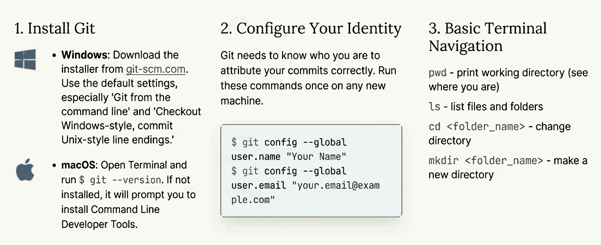
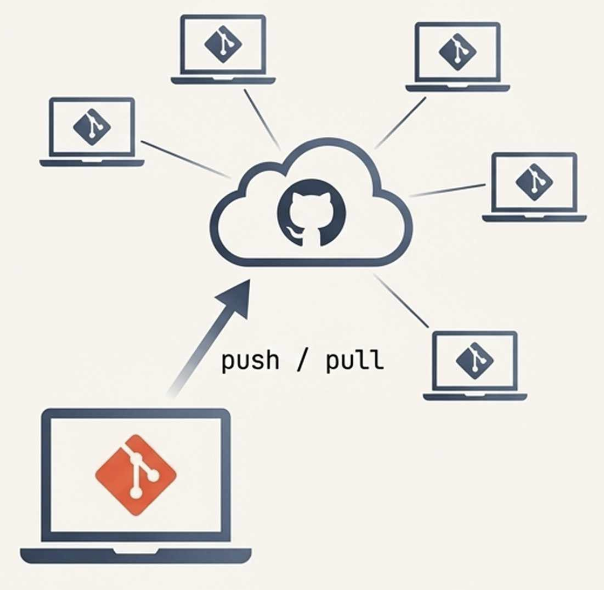
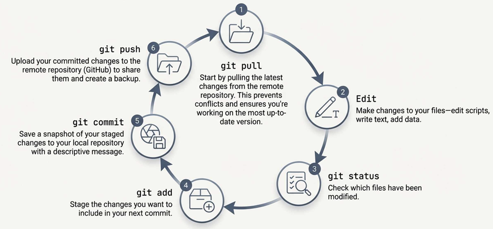

## Today’s goals

Goals:

- Explain what *reproducible research* means (and what it doesn’t)
- Use Git for a basic research workflow: **pull → edit → status → add → commit → push**
- Understand collaboration on GitHub using **branches** and **forks**
- Apply a few best practices that prevent common “Git disasters”

---

## A guiding idea

**In computational science, the paper is not the scholarship; it advertises the scholarship. **

<span style="font-family: 'Times New Roman'; color: blue;">"An article ... in a scientific publication is not the scholarship itself, it is merely advertising of the scholarship, actual scholarship is the complete software environment and the complete set of instructions which generated the figures.” </span>

>— David Donoho

---

## What is reproducible research?

**Reproducibility**: an independent person can obtain the *same results* using:

- the **same data**
- the **same analysis code**
- the **same documented steps / environment**

Key idea: reproducibility is about *verifying the original workflow*.

---

## Reproducibility vs generalizability

- **Reproducible**: same procedures → same result  
- **Generalizable**: result holds in different populations/settings

A study can be reproducible but not generalizable (and vice versa).

A failure to "replicate" often means that research is not generalizable.

---

## Why it matters

When workflows are not reproducible, we risk:

- undetected coding errors
- “invisible” data exclusions or transformations
- incorrect conclusions that spread into policy/practice

---

## A motivating case 

*The Reinhart and Rogoff Case Study*

- The Claim: A highly influential study claimed a strong link
between high national debt and low economic growth, shaping
global debates.

- The Problem: When graduate students attempted to replicate
the findings, they couldn't. The original authors shared their
Excel spreadsheet.

- The Discovery: The replication attempt uncovered major errors:
  - Basic coding mistakes in the Excel spreadsheet.
  - Selective exclusion of data.
  - Unconventional weighting of statistics.

Main takeaway: **transparent workflows prevent silent failure.**

---

## What you should share

A reproducible analysis usually includes:

- raw or minimally processed **data** (or a clear access path)
- **analysis scripts** (R/Python/etc.)
- **documentation** (README + instructions)
- environment details (package versions, OS notes, session info)

---

## Where Git fits in

Git is a **version control system** that:

- records changes to files over time
- lets you compare versions and roll back safely
- supports parallel work (branches) and collaboration

Git is a “time machine” for your project:

- commits are snapshots you can return to
- history is auditable (who changed what, when, and why)

---

## Git vocabulary (minimum set)

- **Repository (repo)**: a project folder tracked by Git
- **Commit**: a snapshot + message (“what changed and why”)
- **Staging area**: what will go into the *next* commit
- **Branch**: a parallel line of development
- **Remote**: a server copy (e.g., GitHub)

---

## Install + verify Git (quick check)



---

## Configure your identity (one-time)

```bash
git config --global user.name "Your Name"
git config --global user.email "your.email@example.com"
```

Verify:

```bash
git config --global user.name
git config --global user.email
```

---

## Repositories: local vs GitHub

- **Local repo**: lives on your computer
- **Remote repo** (GitHub): your backup + collaboration hub

<div style="overflow: auto;">
  
  
Best beginner workflow:

1. Create repo on GitHub  
2. Clone it locally  
3. Work locally  
4. Push changes
</div>


---

## The basic workflow (the one to memorize)

**Pull → Edit → Status → Add → Commit → Push**



```bash
git pull
# edit files
git status
git add .
git commit -m "Describe what changed (and why)"
git push
```

---

## Live demo plan (5 minutes)

We will:

1. Create a GitHub repo
2. Clone it
3. Edit `README.md`
4. Commit + push
5. Confirm the change appears on GitHub

---

## Create a repo (GitHub)

On GitHub:

- New repository
- Add a `README.md` (recommended)
- Choose Public/Private (as instructed for your course)

---

## Clone the repo locally

Copy the repo URL, then:

```bash
cd ~/Documents/Projects   # or your preferred folder
git clone https://github.com/YOUR-USERNAME/YOUR-REPO.git
cd YOUR-REPO
```

---

## `git status` is your dashboard

```bash
git status
```

It tells you:

- what changed
- what’s staged
- what’s untracked

Use it constantly.

---

## Make a change

Edit `README.md` and add a line like:

- your name
- course
- date

Save the file.

---

## Stage changes (`git add`)

Stage **all** changes:

```bash
git add .
```

Or stage a single file:

```bash
git add README.md
```

---

## Commit changes (`git commit`)

```bash
git commit -m "Add course header to README"
```

Commit messages should be:

- specific
- action-oriented
- readable later

---

## Push to GitHub (`git push`)

```bash
git push origin main
```

Now your commit is on the remote.

---

## Quick checkpoint (Try it now)

1. Run `git status`  
2. Make a small edit to `README.md`  
3. Run: `git add README.md`  
4. Run: `git commit -m "Update README"`  
5. Run: `git push`

If anything fails: copy the *exact* error message.

---

## Branching: why researchers should care

Branches let you:

- prototype an analysis without breaking the “main” pipeline
- keep exploratory work separate
- collaborate without stepping on each other

---

## Create and switch to a branch

```bash
git switch -c bootstrap-procedure
# or older syntax:
# git checkout -b bootstrap-procedure
```

Now changes are isolated from `main`.

---

## Typical branch workflow

```bash
git pull origin main
git switch -c feature-analysis
# edit files
git add .
git commit -m "Add bootstrap analysis"
git push -u origin feature-analysis
```

Then open a Pull Request on GitHub.

---

## Merging back to main (concept)

After review/testing:

```bash
git switch main
git pull origin main
git merge feature-analysis
git push origin main
```

---

## Merge conflicts (what they mean)

A conflict means:

- Git can’t automatically combine changes
- You must choose what the final file should contain

Rule: resolve carefully, then commit the resolution.

---

## Collaboration pattern 1: branches (shared repo)

Use branches when:

- everyone has write access to the same repo
- you want a lightweight workflow

---

## Collaboration pattern 2: forks (public repo)

Use forks when:

- you **don’t** have write access to the original repo
- you want your own copy under your account

Flow:

1. Fork on GitHub  
2. Clone your fork  
3. Push changes  
4. Open a PR back to the original

---

## Pull requests (PRs): what they accomplish

PRs provide:

- a review conversation
- a visible record of what changed
- a safe merge process

Think: “proposal to merge work into main.”

---

## Version control for research artifacts

Git works well for:

- analysis scripts (`.R`, `.py`)
- manuscripts (`.Rmd`, `.tex`, `.md`)
- stimuli and experiment scripts (reasonable-sized files)
- documentation (README + notes)

---

## Repository structure (recommended)

A simple pattern:

```
project/
  data/        # often ignored if large or sensitive
  scripts/
  results/     # often ignored if generated
  docs/
  README.md
```

---

## `.gitignore`: prevent tracking the wrong files

Common things to ignore:

- large raw data extracts
- generated outputs (`results/`, logs)
- secrets (API keys)

Example:

```gitignore
/results/
/*.log
/data/*.csv
/data/*.tsv
```

---

## Markdown + GitHub (why you care)

Markdown is for:

- READMEs
- lab notes
- simple reports

GitHub renders `.md` automatically, so your documentation becomes readable online.

---

## Markdown basics (quick)

- Headings: `#`, `##`, `###`
- Emphasis: `*italic*`, `**bold**`
- Lists: `- item`
- Code: backticks for inline, fenced blocks for chunks

---

## Tracking changes: `git diff`

Unstaged differences:

```bash
git diff
```

Staged differences:

```bash
git diff --cached
```

Tip: review diffs before committing.

---

## History: `git log`

Simple history:

```bash
git log
```

Compact history:

```bash
git log --oneline
```

Graph view:

```bash
git log --oneline --graph --all
```

---

## File-level forensic tools

- File history:

```bash
git log -- path/to/file.R
```

- Who changed a line:

```bash
git blame path/to/file.R
```

Great for debugging and understanding provenance.

---

## Tags: “bookmarks” for milestones

Use tags to mark:

- versions used in manuscripts
- analysis freeze points
- releases

Annotated tag:

```bash
git tag -a manuscript-submission -m "Version for journal submission"
git push origin manuscript-submission
```

---

## The “detached HEAD” warning

If you `checkout` a tag, you are not on a branch.

Safe practice:

- inspect and run code, but don’t commit
- if you need changes, create a branch from the tag:

```bash
git checkout -b revision-from-submission manuscript-submission
```

---

## Best practices that save time

- Commit early and often (small, logical commits)
- Write messages that explain *why*, not just *what*
- Pull before you start working each day
- Don’t commit generated junk (use `.gitignore`)
- Treat GitHub as both backup and collaboration space

---

## Common student mistakes (and fixes)

- “I lost my work” → check `git status`, `git log`, and branch name
- “Nothing to commit” → you likely forgot to save, or you’re on the wrong repo
- “Authentication failed” → re-check GitHub token / credential manager
- “Merge conflict” → resolve file markers, then commit

---

## Mini-exercise (5 minutes)

In your repo:

1. Create a branch `practice-branch`  
2. Add one sentence to `README.md`  
3. Commit and push the branch  
4. Open a PR on GitHub (no need to merge yet)

Commands:

```bash
git switch -c practice-branch
# edit README.md
git add README.md
git commit -m "Add practice note to README"
git push -u origin practice-branch
```

---

## Wrap-up checklist

Before you submit an assignment repo, confirm:

- `README.md` explains what the project is and how to run it
- your work is on GitHub (not just local)
- commits are meaningful and not one giant dump
- no sensitive or large data files are accidentally tracked

---

## Next steps

- Complete the assignment instructions in your course materials
- Keep a “daily workflow” sticky note:
  - pull → edit → status → add → commit → push
- When stuck, capture:
  - the command you ran
  - the exact error text
  - your `git status` output

---

## Appendix: command cheat sheet

```bash
# status + review
git status
git diff
git diff --cached
git log --oneline --graph --all

# basic workflow
git pull
git add .
git commit -m "message"
git push

# branches
git switch -c new-branch
git switch main
git merge new-branch

# tags
git tag -a v1.0 -m "milestone"
git push origin v1.0
```
