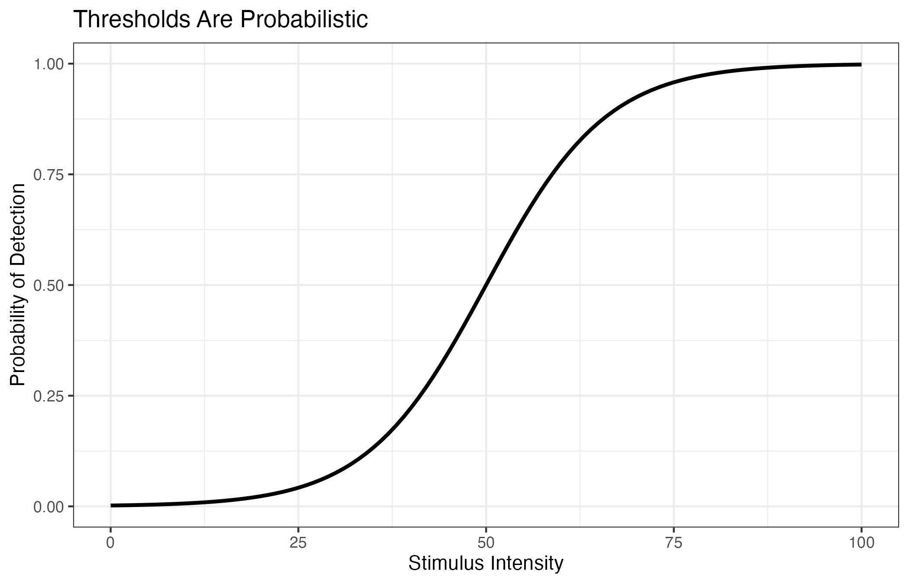
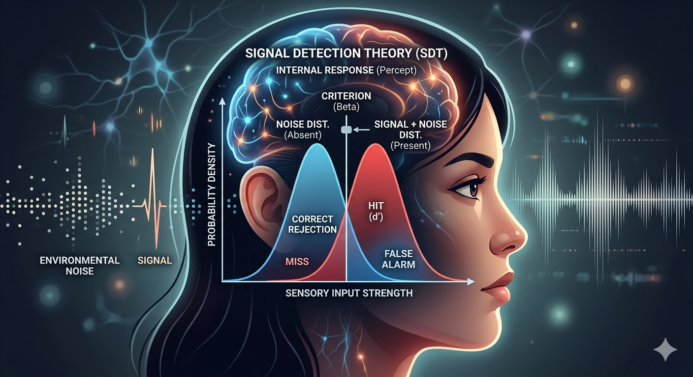

```{r echo=FALSE}
# This chunk sets up the R environment for the rest of the document
knitr::opts_chunk$set(
  echo = TRUE,       # Show the R code
  message = FALSE,   # Hide messages
  warning = FALSE,   # Hide warnings
  fig.align = "center", # Center plots
  out.width = '70%'
)
```


<div style="text-align: center;">
  
</div>

<div class="chapter-opening">
<p class="lead">
Sensation and perception research asks a distinctive methodological question: how can psychologists measure private, subjective experience in a rigorous and reproducible way? The answer is psychophysics, threshold measurement, and experimental designs that connect physical stimuli to behavioral responses.
</p>
</div>

Imagine that a researcher wants to know whether a new pain reliever actually reduces pain, rather than simply making patients say they feel better. One way to test this is to present carefully controlled stimuli, such as heat, cold, or pressure, and measure the point at which participants first report pain, how intense that pain feels, and whether those judgments change after taking the drug. This is a sensation and perception problem: the researcher is studying how a physical stimulus is translated into a sensory experience and a behavioral response. In this way, sensation and perception research provides methods that are useful not only in the laboratory, but also in a number of clinical and medical settings.

In many areas of psychology, researchers are interested in attitudes, memories, emotions, or decision making. In sensation and perception, however, the central problem is slightly different. Researchers want to understand how organisms detect, discriminate, and interpret stimuli from the environment. That means the methods of this area must be especially sensitive to small changes in sound, light, pressure, taste, smell, or spatial arrangement.

This creates a methodological challenge. Sensory experience is mostly private, and perceptual reports are influenced not only by the stimulus itself, but also by internal psychological processes like attention, expectation, fatigue, and response strategy. A participant who says "yes, I heard it" may truly have detected a faint tone, or may simply be using a very liberal response strategy - showing a tendency to respond "yes" when they are unsure whether they heard the tone or not. Likewise, a participant who says “no” may have failed to hear the tone, or may be responding conservatively - showing a tendency to respond "no" in the face of uncertainty. In other words, perception research requires methods that separate **sensitivity** from **decision**.

This chapter focuses on the research methods used in sensation and perception research. We will examine how psychologists measure thresholds, how they design experiments to study sensory discrimination, how Weber’s and Fechner’s laws formalized psychophysical measurement, how the **method of limits** and related procedures work, and how **signal detection theory** helps researchers interpret detection performance.

We will also consider the kinds of dependent measures that sensation and perception researchers use, the importance of controlling the sensory environment, and the logic of several classic experimental paradigms.

## The Foundation

The goal of sensation and perception research is to relate **physical properties of stimuli** to **psychological responses**.

For example, a researcher might ask:

* How bright must a light be before a participant can detect it?
* How much heavier must one object be than another before the difference is noticeable?
* How much louder must a tone become before listeners can tell that it has changed?
* How accurately can participants distinguish signal from noise?

These questions all involve the relationship between a **stimulus** and a **behavioral response**. In psychophysics, this relationship is often studied by varying the stimulus systematically and recording how often participants report detection, discrimination, or identification.

That means sensation and perception research is fundamentally about **measurement**. Researchers must decide things like:

* what counts as a response,
* how stimulus intensity will be manipulated,
* how thresholds will be estimated,
* and whether observed performance reflects true sensitivity, response bias, or both.

**Psychophysics** is a specialized branch of psychology primarily concerned with understanding the relationship between physical stimuli and psychological experience. It is one of the oldest areas of experimental psychology, and it remains methodologically important because it provides formal tools for studying sensation and perception. The central achievement of psychophysics was to show that subjective experience could be studied quantitatively, by developing experimental methods for estimating thresholds and modeling perceptual judgments.

## Core Terms

Several concepts appear repeatedly in the methods of psychophysics:

* **absolute threshold**: the minimum intensity of a stimulus that can be detected a specified proportion of the time
* **difference threshold**: the smallest detectable difference between two stimuli
* **just noticeable difference (JND)**: another term for the difference threshold
* **sensitivity**: how well a participant can distinguish signal from noise or one stimulus from another
* **response bias**: a participant’s tendency to favor one response over another
* **psychometric function**: a curve relating stimulus intensity to response probability

## Thresholds: The Basic Unit of Measurement

```{r, echo=FALSE}
library(ggplot2)
library(tibble)
library(dplyr)

threshold_data <- tibble(
  intensity = seq(0, 100, by = 1)
) %>%
  mutate(
    p_detect = 1 / (1 + exp(-(intensity - 50) / 8))
  )

p <- ggplot(threshold_data, aes(x = intensity, y = p_detect)) +
  geom_line(linewidth = 1) +
  labs(
    title = "Thresholds Are Probabilistic",
    x = "Stimulus Intensity",
    y = "Probability of Detection"
  ) +
  theme_bw()

ggsave("images/threshold_plot.png", plot = p, width = 7, height = 4.5, dpi = 300)
```

<div class="figure-box figure-right" style="width: 48%;">
  
  <p class="figure-box-caption">
    <strong>Figure 1.</strong> A psychometric-style function showing that detection becomes more likely as stimulus intensity increases.
  </p>
</div>

in Psychophysics, a threshold is not a hard, fixed point where a participant suddenly changes from “cannot detect” to “can detect.” Instead, thresholds are usually **probabilistic**. For example, in a pain study, a heat stimulus at a certain temperature might be judged as painful on some trials but not on others. This does not necessarily mean the participant is being inconsistent in a careless way. Rather, it reflects the fact that perception is influenced by many factors, including moment-to-moment variation in sensory processing, attention, expectation, and response bias. Because of this, researchers estimate thresholds by looking at how often a stimulus is detected or judged as painful across repeated trials, rather than treating perception as a simple yes/no switch.

## Absolute Threshold

In psychophysics, the probabilistic view of perception is built directly into the definition of concepts like the **absolute threshold**. Rather than marking a sharp boundary, the absolute threshold is defined in terms of the likelihood of detection across repeated presentations.

> The absolute threshold is the minimum intensity of a stimulus that can be detected a specified proportion (e.g., 50%) of the time.

Examples:

* the faintest tone a participant can hear
* the dimmest light a participant can see
* the weakest pressure a participant can feel on the skin


## Difference Threshold

The **difference threshold** or **JND** is the smallest detectable difference between two stimuli.

Examples:

* How much louder must one tone be than another before the listener notices the difference?
* How much heavier must one weight be than another before the participant can tell them apart?
* How much brighter must one patch of light be than another before the difference is noticeable?

The important methodological point is that thresholds are estimated from repeated judgments, not guessed from a single trial.

<div class="callout-note">
<span class="callout-title">Teaching Note</span>
Students often imagine thresholds as sharp boundaries, but perceptual performance usually changes gradually across stimulus levels. That is why repeated measurement and probability-based interpretation are so important in this area.
</div>

# Weber’s Law

One of the earliest and most important findings in psychophysics is **Weber’s Law**.

Weber observed that the just noticeable difference is not usually determined by a fixed amount of change. Instead, the JND tends to depend on the **proportion** of change relative to the original stimulus.

The law is usually written as:

$$
\frac{\Delta I}{I} = k
$$

where:

* $I$ is the original stimulus intensity
* $\Delta I$ is the change needed for the difference to be noticed
* $k$ is a constant for a particular sensory dimension

### Interpreting Weber’s Law

The logic is simple:

* if the starting intensity is small, a relatively small change may be noticeable
* if the starting intensity is large, a larger absolute change is needed

For example, if a participant can notice a 2-gram increase when lifting a 20-gram weight, they may need a much larger increase to notice the difference when lifting a 200-gram weight.

### Why Weber’s Law Matters Methodologically

Weber’s Law matters because it shows that sensitivity is often **relative**, not absolute. That means:

* researchers must choose stimulus values carefully
* comparisons across sensory conditions should account for baseline intensity
* the same absolute increase may be easy to detect in one context and difficult in another

## Interactive Example: Weber’s Law

```{r, echo=FALSE}
library(shiny)
library(tidyverse)
library(plotly)

fluidRow(
  column(
    width = 4,
    sliderInput("base_intensity", "Baseline intensity (I)",
                min = 10, max = 200, value = 50, step = 5),
    sliderInput("weber_constant", "Weber constant (k)",
                min = 0.02, max = 0.30, value = 0.10, step = 0.01)
  ),
  column(
    width = 8,
    tableOutput("weber_table"),
    plotlyOutput("weber_plot")
  )
)

weber_data <- reactive({
  tibble(
    baseline = seq(10, 200, by = 10),
    k = input$weber_constant,
    jnd = baseline * k
  )
})

output$weber_table <- renderTable({
  tibble(
    Baseline_Intensity = input$base_intensity,
    Weber_Constant = input$weber_constant,
    JND = round(input$base_intensity * input$weber_constant, 2)
  )
})

output$weber_plot <- renderPlotly({
  p <- ggplot(weber_data(), aes(
    x = baseline,
    y = jnd,
    text = paste0(
      "Baseline: ", baseline,
      "<br>JND: ", round(jnd, 2)
    )
  )) +
    geom_line(linewidth = 1) +
    geom_point() +
    geom_point(
      data = tibble(
        baseline = input$base_intensity,
        jnd = input$base_intensity * input$weber_constant
      ),
      aes(x = baseline, y = jnd),
      size = 3,
      inherit.aes = FALSE
    ) +
    labs(
      title = "Weber's Law",
      x = "Baseline Intensity (I)",
      y = "Just Noticeable Difference (Delta I)"
    ) +
    theme_bw()

  ggplotly(p, tooltip = "text")
})
```

<div class="callout-check">
<span class="callout-title">Student Check</span>
What happens to the JND as the baseline intensity increases? How does changing the Weber constant affect the slope of the line?
</div>

### Limits of Weber’s Law

Weber’s Law is an approximation, not a universal rule. It often works best in middle ranges of stimulus intensity and may be less accurate at very low or very high levels.

# Fechner’s Law

**Fechner’s Law** built on Weber’s work by proposing a mathematical relationship between physical stimulus intensity and subjective sensation.

Fechner reasoned that if each JND represented a roughly equal unit of subjective change, then sensation could be scaled by accumulating JNDs. This led to the idea that perceived sensation grows logarithmically with stimulus intensity.

The law is often written as:

$$
S = k \log(I)
$$

where:

* $S$ is the subjective sensation
* $I$ is the physical intensity
* $k$ is a constant

### Why Fechner’s Law Matters

Fechner’s Law is historically important because it was one of the earliest attempts to place psychological experience on a quantitative scale.

Methodologically, it matters because it shows that researchers in sensation and perception were not only measuring whether a stimulus could be detected, but also trying to understand how **subjective intensity** changes as the physical stimulus changes.

### Assumptions and Limits

Fechner’s Law depends on assumptions, especially the idea that JNDs can be treated as equal subjective units. That assumption is not always justified, so the law is best understood as a historically important model rather than a perfect general account.

<div class="callout-note">
<span class="callout-title">Teaching Note</span>
Weber’s Law is about the size of detectable differences. Fechner’s Law is about scaling subjective experience. Students often confuse the two, so it helps to emphasize that Weber focused on JNDs, while Fechner tried to build a broader model of sensation from them.
</div>

# Classical Psychophysical Methods

Psychophysics developed several classic procedures for estimating thresholds. These methods differ in speed, precision, and susceptibility to bias.

## The Method of Limits

The **method of limits** is one of the oldest and most intuitive psychophysical procedures.

In this method, stimuli are presented in either:

* **ascending order**, starting below threshold and increasing until the participant reports detection
* **descending order**, starting above threshold and decreasing until the participant no longer reports detection

The points at which the participant’s response changes are called **transition points**, and threshold is estimated by averaging these across runs.

### Strengths

* relatively efficient
* easy to understand
* useful for teaching threshold estimation

### Weaknesses

* **anticipation errors**
* **habituation errors**
* order effects
* practice effects

## Interactive Example: Method of Limits

```{r, echo=FALSE}
fluidRow(
  column(
    width = 4,
    sliderInput("true_threshold", "Underlying threshold",
                min = 10, max = 80, value = 40, step = 1),
    sliderInput("step_size", "Step size",
                min = 1, max = 10, value = 5, step = 1),
    numericInput("n_runs", "Number of ascending/descending runs",
                 value = 4, min = 2, max = 20, step = 1)
  ),
  column(
    width = 8,
    tableOutput("limits_table")
  )
)

limits_results <- reactive({
  set.seed(123)
  asc_transition <- sapply(1:input$n_runs, function(i) {
    vals <- seq(0, 100, by = input$step_size)
    crossed <- vals[vals >= (input$true_threshold + rnorm(1, 0, 3))]
    if (length(crossed) == 0) NA else min(crossed)
  })

  desc_transition <- sapply(1:input$n_runs, function(i) {
    vals <- seq(100, 0, by = -input$step_size)
    crossed <- vals[vals <= (input$true_threshold + rnorm(1, 0, 3))]
    if (length(crossed) == 0) NA else max(crossed)
  })

  tibble(
    Run = 1:input$n_runs,
    Ascending_Transition = asc_transition,
    Descending_Transition = desc_transition,
    Mean_Run_Threshold = rowMeans(cbind(asc_transition, desc_transition), na.rm = TRUE)
  )
})

output$limits_table <- renderTable({
  df <- limits_results()
  overall <- round(mean(df$Mean_Run_Threshold, na.rm = TRUE), 2)
  df %>%
    mutate(Overall_Estimate = c(overall, rep("", n() - 1)))
})
```

<div class="callout-check">
<span class="callout-title">Student Check</span>
How does the threshold estimate change when the step size becomes larger? Why might large steps reduce precision?
</div>

A real clinical example comes from research on **patients with diabetes**, where vibrotactile thresholds were measured to evaluate possible sensory impairment. In one published study, Gerr and colleagues compared a **method of limits** procedure with a forced-choice procedure in 22 diabetes patients from a hospital clinic. By varying vibration intensity and recording when patients reported detection, the researchers could estimate sensory thresholds and evaluate whether the method of limits provided a reliable and efficient way to measure possible nerve-related sensory changes. :contentReference[oaicite:1]{index=1} 

## The Method of Constant Stimuli

In the **method of constant stimuli**, the researcher chooses a fixed set of stimulus intensities and presents them many times in random order. Participants respond on each trial, and the researcher computes the proportion of times each stimulus level is detected.

### Strengths

* reduced order effects
* more precise threshold estimation
* well suited for building psychometric functions

### Weaknesses

* time-consuming
* may include many trials at intensities that are too easy or too hard to be informative

## The Method of Adjustment

In the **method of adjustment**, participants directly control the stimulus and adjust it until it is just detectable or until it matches a criterion.

### Strengths

* quick
* intuitive

### Weaknesses

* less precise
* influenced strongly by participant strategy
* vulnerable to individual response styles

<div class="callout-tip">
<span class="callout-title">Tips &amp; Tricks</span>
The three classic psychophysical methods involve a common tradeoff: faster methods are usually less precise, and more precise methods are usually slower.
</div>

# Psychometric Functions

A **psychometric function** is a curve that relates stimulus intensity to the probability of a particular response.

For example, as the intensity of a tone increases, the probability that the participant says “yes, I heard it” also increases.

Psychometric functions are important because they show that thresholds are not hard cutoffs. Instead, performance usually changes gradually.

## Interactive Example: Psychometric Function

```{r, echo=FALSE}
fluidRow(
  column(
    width = 4,
    sliderInput("pf_threshold", "Function midpoint",
                min = 10, max = 90, value = 50, step = 1),
    sliderInput("pf_slope", "Slope",
                min = 0.05, max = 0.40, value = 0.15, step = 0.01)
  ),
  column(
    width = 8,
    plotlyOutput("psychometric_plot")
  )
)

psychometric_data <- reactive({
  tibble(
    intensity = seq(0, 100, by = 1)
  ) %>%
    mutate(
      p_detect = 1 / (1 + exp(-(intensity - input$pf_threshold) * input$pf_slope))
    )
})

output$psychometric_plot <- renderPlotly({
  p <- ggplot(psychometric_data(), aes(
    x = intensity,
    y = p_detect,
    text = paste0(
      "Intensity: ", intensity,
      "<br>P(detect): ", round(p_detect, 3)
    )
  )) +
    geom_line(linewidth = 1) +
    labs(
      title = "Psychometric Function",
      x = "Stimulus Intensity",
      y = "Probability of Detection"
    ) +
    theme_bw()

  ggplotly(p, tooltip = "text")
})
```

<div class="callout-check">
<span class="callout-title">Student Check</span>
What happens when the slope becomes steeper? What does a shallow slope suggest about consistency of responding?
</div>

# Experimental Designs in Sensation and Perception

Sensation and perception research often relies on repeated trials and carefully controlled stimulus manipulations. Because thresholds and discrimination performance are usually estimated from many responses, **within-subjects designs** are especially common.

## Within-Subjects Designs

In a within-subjects design, each participant experiences multiple stimulus levels or experimental conditions.

### Advantages

* controls for individual differences
* statistically efficient
* especially useful when perceptual sensitivity differs greatly across people

### Risks

* practice effects
* fatigue
* sensory adaptation
* carryover effects

## Between-Subjects Designs

Between-subjects designs are less common for basic threshold estimation, but they may be useful when repeated exposure would contaminate performance.

## Mixed Designs

Mixed designs combine within-subjects and between-subjects factors.

## Counterbalancing and Stimulus Control

Perception experiments are highly sensitive to methodological details. Researchers often need to control:

* viewing distance
* screen brightness and contrast
* room illumination
* sound level and headphone quality
* timing precision
* order of trials
* feedback
* participant instructions

<div class="callout-warning">
<span class="callout-title">Common Mistake</span>
Sensation and perception experiments can look simple on the surface, but they depend heavily on precise stimulus control. A poorly calibrated monitor or inconsistent sound level can undermine the entire study.
</div>

# Common Dependent Measures

Researchers in sensation and perception use several types of dependent variables.

## Detection Responses

* yes/no
* present/absent
* seen/not seen

## Discrimination Accuracy

* correct/incorrect
* same/different
* forced-choice accuracy

## Threshold Estimates

* absolute threshold
* JND
* point of subjective equality

## Reaction Time

Reaction time can indicate processing speed, uncertainty, or task difficulty.

## Confidence Ratings

Confidence judgments are often useful when researchers want to know how certain participants are about their perceptual decisions.

# Forced-Choice Methods

A **forced-choice** task requires the participant to choose among alternatives rather than simply saying “yes” or “no.”

Examples:

* In a **2AFC** task, participants decide which of two intervals contained the stimulus.
* In a spatial forced-choice task, participants decide whether the target appeared on the left or the right.

## Why Forced-Choice Methods Matter

Forced-choice methods are important because they reduce some forms of response bias. In a yes/no task, participants can set a liberal or conservative criterion. In a forced-choice task, they must choose one of the available alternatives.

## Chance Performance

Forced-choice tasks also make it clear that some level of performance is expected by chance.

<div class="callout-note">
<span class="callout-title">Teaching Note</span>
Forced-choice methods do not eliminate all bias or difficulty, but they often give cleaner estimates than yes/no detection tasks because participants cannot simply prefer saying “yes” or “no.”
</div>

# Signal Detection Theory

<div style="float: right; width: 100%; margin-left: 20px; margin-bottom: 10px;">
  
</div>

Signal detection theory is one of the most important methodological frameworks in sensation and perception because it separates **sensitivity** from **response bias**.

Traditional threshold methods often assume that detection performance directly reflects sensory ability. Signal detection theory shows that this is incomplete. A participant’s response depends not only on what they sensed, but also on how much evidence they require before saying “yes.”

# Why Signal Detection Theory Was Needed

Imagine a task in which a participant listens for a faint tone embedded in background noise. On some trials, the tone is present. On other trials, it is absent.

A participant may say “yes” for at least two different reasons:

* they are genuinely sensitive to the signal
* they are willing to respond “yes” whenever they are uncertain

Likewise, a participant may say “no” either because the signal was not detected or because the participant used a conservative criterion.

This means that **raw detection rates alone are not enough**.

# Signal and Noise

Signal detection theory assumes that the observer is making judgments under uncertainty. Even when no signal is present, internal and external noise can create some sensory evidence. When a signal is present, the sensory evidence tends to be stronger on average, but still varies from trial to trial.

In the classic framework, we imagine two overlapping distributions:

* a **noise distribution**
* a **signal-plus-noise distribution**

The observer places a **decision criterion** somewhere on this evidence continuum.

* Evidence above criterion -> respond “yes”
* Evidence below criterion -> respond “no”

## Why Overlap Matters

If the distributions overlap a great deal, detection is difficult. If they are well separated, detection is easier.

That leads to two key ideas:

* **sensitivity** reflects how far apart the two distributions are
* **criterion** reflects where the observer places the decision threshold

# The Four Outcomes

In a yes/no detection task, there are four possible outcomes.

| Signal Status | Participant Response | Outcome |
|---|---|---|
| Signal present | Yes | Hit |
| Signal present | No | Miss |
| Signal absent | Yes | False Alarm |
| Signal absent | No | Correct Rejection |

These four outcomes are the foundation of signal detection analysis.

## Hits and False Alarms

Two values are especially important:

* **hit rate** = proportion of signal-present trials on which the participant said “yes”
* **false alarm rate** = proportion of signal-absent trials on which the participant said “yes”

A participant with a high hit rate might seem highly sensitive, but if that same participant also has a high false alarm rate, the interpretation changes.

<div class="callout-warning">
<span class="callout-title">Common Mistake</span>
Do not interpret a high hit rate by itself as strong perceptual sensitivity. A participant can produce many hits simply by saying “yes” very often.
</div>

# Sensitivity and Response Bias

Signal detection theory separates two things that ordinary accuracy scores can blur together.

## Sensitivity

**Sensitivity** refers to how well the participant distinguishes signal from noise. In classical SDT, this is often summarized by **d-prime**, written as $d'$.

A larger $d'$ means the signal and noise distributions are more separated, so the observer can distinguish them more effectively.

## Response Bias

**Response bias** or **criterion** refers to the participant’s decision tendency.

A participant may use a:

* **liberal criterion**: more likely to say “yes”
* **conservative criterion**: more likely to say “no”

A liberal participant tends to produce more hits, but also more false alarms.

A conservative participant tends to produce fewer false alarms, but also more misses.

# Computing Hit Rate and False Alarm Rate

Suppose a participant completed 100 signal-present trials and 100 signal-absent trials.

If they produced:

* 82 hits
* 18 misses
* 24 false alarms
* 76 correct rejections

then:

$$
\text{Hit Rate} = \frac{82}{100} = 0.82
$$

$$
\text{False Alarm Rate} = \frac{24}{100} = 0.24
$$

These values tell us much more than overall percent correct.

## R Implementation

```{r}
sdt_example <- tibble(
  Outcome = c("Hit", "Miss", "False Alarm", "Correct Rejection"),
  Count = c(82, 18, 24, 76)
)

sdt_example
```

```{r}
hits <- 82
misses <- 18
false_alarms <- 24
correct_rejections <- 76

hit_rate <- hits / (hits + misses)
fa_rate <- false_alarms / (false_alarms + correct_rejections)

tibble(
  Hit_Rate = hit_rate,
  False_Alarm_Rate = fa_rate
)
```

# A First Approximation to Sensitivity

A useful classroom intuition is that better sensitivity usually means:

* high hit rate
* low false alarm rate

That is not yet the full SDT model, but it is a good starting point.

## Interactive Example: Hits, False Alarms, and Interpretation

```{r, echo=FALSE}
fluidRow(
  column(
    width = 4,
    sliderInput("hit_rate", "Hit rate",
                min = 0.05, max = 0.99, value = 0.80, step = 0.01),
    sliderInput("fa_rate", "False alarm rate",
                min = 0.01, max = 0.95, value = 0.20, step = 0.01)
  ),
  column(
    width = 8,
    tableOutput("sdt_table"),
    plotlyOutput("sdt_space_plot")
  )
)

output$sdt_table <- renderTable({
  hr <- input$hit_rate
  far <- input$fa_rate

  tibble(
    Measure = c("Hit Rate", "False Alarm Rate", "Sensitivity Interpretation", "Bias Interpretation"),
    Value = c(
      round(hr, 2),
      round(far, 2),
      ifelse((hr - far) > 0.5, "High sensitivity",
             ifelse((hr - far) > 0.2, "Moderate sensitivity", "Low sensitivity")),
      ifelse(far > 0.40, "Liberal responding",
             ifelse(far < 0.10, "Conservative responding", "Moderate criterion"))
    )
  )
})

output$sdt_space_plot <- renderPlotly({
  df <- tibble(
    x = input$fa_rate,
    y = input$hit_rate
  )

  p <- ggplot(df, aes(
    x = x,
    y = y,
    text = paste0(
      "False Alarm Rate: ", round(x, 2),
      "<br>Hit Rate: ", round(y, 2)
    )
  )) +
    geom_point(size = 4) +
    xlim(0, 1) +
    ylim(0, 1) +
    labs(
      title = "Signal Detection Performance Space",
      x = "False Alarm Rate",
      y = "Hit Rate"
    ) +
    theme_bw()

  ggplotly(p, tooltip = "text")
})
```

<div class="callout-check">
<span class="callout-title">Student Check</span>
What does it mean if a participant is in the upper-right region of the plot, with both high hit rate and high false alarm rate? What about the upper-left region?
</div>

# d-Prime and Criterion

A more formal treatment of signal detection theory uses the normal distribution to compute sensitivity and bias.

The most common sensitivity measure is:

$$
d' = z(\text{Hit Rate}) - z(\text{False Alarm Rate})
$$

where $z(.)$ is the z-score transformation.

A larger $d'$ indicates greater separation between the signal and noise distributions.

A common measure of criterion is:

$$
c = -\frac{1}{2}\left[z(\text{Hit Rate}) + z(\text{False Alarm Rate})\right]
$$

Interpreting $c$:

* positive values -> more conservative criterion
* negative values -> more liberal criterion
* values near zero -> more neutral criterion

## R Implementation

```{r}
# Example rates
hr <- 0.82
far <- 0.24

# Avoid extreme values of 0 or 1 in real analyses
d_prime <- qnorm(hr) - qnorm(far)
criterion_c <- -0.5 * (qnorm(hr) + qnorm(far))

tibble(
  Hit_Rate = hr,
  False_Alarm_Rate = far,
  d_prime = round(d_prime, 3),
  criterion_c = round(criterion_c, 3)
)
```

<div class="callout-note">
<span class="callout-title">Teaching Note</span>
For an introductory methods course, students do not need to master every mathematical detail of signal detection theory. The key lesson is conceptual: detection performance reflects both sensitivity and response bias.
</div>

## Interactive Example: d' and Criterion

```{r, echo=FALSE}
fluidRow(
  column(
    width = 4,
    sliderInput("hr2", "Hit rate for d'",
                min = 0.01, max = 0.99, value = 0.80, step = 0.01),
    sliderInput("far2", "False alarm rate for d'",
                min = 0.01, max = 0.99, value = 0.20, step = 0.01)
  ),
  column(
    width = 8,
    tableOutput("dprime_table")
  )
)

output$dprime_table <- renderTable({
  hr <- input$hr2
  far <- input$far2

  dprime <- qnorm(hr) - qnorm(far)
  c_value <- -0.5 * (qnorm(hr) + qnorm(far))

  tibble(
    Measure = c("Hit Rate", "False Alarm Rate", "d-prime (d')", "Criterion (c)"),
    Value = c(
      round(hr, 2),
      round(far, 2),
      round(dprime, 3),
      round(c_value, 3)
    )
  )
})
```

<div class="callout-check">
<span class="callout-title">Student Check</span>
Try increasing both the hit rate and the false alarm rate together. Does d' always improve? What happens to the criterion value?
</div>

# A Visual Demonstration of Criterion

One of the best ways to teach response bias is to show that the same sensory sensitivity can produce different response patterns depending on where the decision criterion is placed.

## Interactive Example: Moving the Criterion

```{r, echo=FALSE}
fluidRow(
  column(
    width = 4,
    sliderInput("criterion_pos_fill", "Decision criterion",
                min = -1, max = 4, value = 1.5, step = 0.1),
    sliderInput("signal_mean_fill", "Signal+noise mean",
                min = 0.5, max = 4, value = 2.0, step = 0.1),
    numericInput("n_signal_trials", "Number of signal-present trials",
                 value = 100, min = 20, max = 500, step = 10),
    numericInput("n_noise_trials", "Number of signal-absent trials",
                 value = 100, min = 20, max = 500, step = 10)
  ),
  column(
    width = 8,
    plotOutput("criterion_fill_plot", height = "450px"),
    tableOutput("criterion_fill_table")
  )
)

output$criterion_fill_plot <- renderPlot({
  criterion <- input$criterion_pos_fill
  signal_mean <- input$signal_mean_fill

  x_vals <- seq(-4, 6, length.out = 800)

  noise_df <- tibble(
    x = x_vals,
    density = dnorm(x_vals, mean = 0, sd = 1),
    Distribution = "Noise"
  )

  signal_df <- tibble(
    x = x_vals,
    density = dnorm(x_vals, mean = signal_mean, sd = 1),
    Distribution = "Signal + Noise"
  )

  # Regions for shading
  false_alarm_df <- noise_df %>%
    filter(x >= criterion)

  hit_df <- signal_df %>%
    filter(x >= criterion)

  ggplot() +
    geom_area(
      data = false_alarm_df,
      aes(x = x, y = density),
      fill = "tomato",
      alpha = 0.45
    ) +
    geom_area(
      data = hit_df,
      aes(x = x, y = density),
      fill = "steelblue",
      alpha = 0.45
    ) +
    geom_line(
      data = noise_df,
      aes(x = x, y = density),
      linewidth = 1
    ) +
    geom_line(
      data = signal_df,
      aes(x = x, y = density),
      linewidth = 1,
      linetype = "dashed"
    ) +
    geom_vline(
      xintercept = criterion,
      linewidth = 1,
      linetype = "dotted"
    ) +
    annotate("text", x = -0.2, y = 0.42, label = "Noise", size = 5) +
    annotate("text", x = signal_mean + 0.3, y = 0.32, label = "Signal + Noise", size = 5) +
    annotate("text", x = criterion + 1.2, y = 0.16, label = "Hits", color = "steelblue", size = 5) +
    annotate("text", x = criterion + 1.2, y = 0.08, label = "False Alarms", color = "tomato", size = 5) +
    labs(
      title = "Signal Detection Theory: Criterion and Outcomes",
      subtitle = "Blue shaded area = hits; red shaded area = false alarms",
      x = "Internal Evidence",
      y = "Density"
    ) +
    theme_bw()
})

output$criterion_fill_table <- renderTable({
  criterion <- input$criterion_pos_fill
  signal_mean <- input$signal_mean_fill

  # Probabilities from the normal distributions
  hit_rate <- 1 - pnorm(criterion, mean = signal_mean, sd = 1)
  miss_rate <- pnorm(criterion, mean = signal_mean, sd = 1)

  false_alarm_rate <- 1 - pnorm(criterion, mean = 0, sd = 1)
  correct_rejection_rate <- pnorm(criterion, mean = 0, sd = 1)

  n_signal <- input$n_signal_trials
  n_noise <- input$n_noise_trials

  tibble(
    Outcome = c("Hits", "Misses", "False Alarms", "Correct Rejections"),
    Probability = round(c(hit_rate, miss_rate, false_alarm_rate, correct_rejection_rate), 3),
    Expected_Count = round(c(
      hit_rate * n_signal,
      miss_rate * n_signal,
      false_alarm_rate * n_noise,
      correct_rejection_rate * n_noise
    ), 1)
  )
})
```

<div class="callout-check">
<span class="callout-title">Student Check</span>
What happens when the criterion is moved to the right? Why does that usually reduce false alarms but increase misses?
</div>

# Why Signal Detection Theory Is Methodologically Important

Signal detection theory matters because it changes how researchers interpret data.

Without SDT, a researcher might conclude:

> This participant detected more signals, so they must be more sensitive.

With SDT, the researcher asks:

* Did the participant truly distinguish signal from noise better?
* Or did they simply use a more liberal response strategy?

That is a more sophisticated and methodologically accurate question.

## When SDT Is Especially Useful

Signal detection theory is especially useful when:

* responses are made under uncertainty
* there is meaningful noise in the task
* yes/no judgments are used
* the researcher wants to distinguish sensitivity from bias

Examples:

* hearing faint sounds
* detecting a dim visual target
* identifying a briefly presented stimulus
* eyewitness identification
* medical screening tasks
* vigilance and monitoring tasks

# Apparatus and Stimulus Control

In sensation and perception, apparatus is not a minor detail. It is part of the method.

Researchers often need to control:

* luminance and contrast on monitors
* sound intensity and frequency
* timing of stimulus onset and offset
* viewing distance
* room lighting
* background noise
* tactile stimulus location and pressure

This is one reason methods sections in sensation and perception papers are often highly detailed.

# Example Research Paradigms

## Absolute Threshold for Tone Detection

* **IV**: tone intensity
* **DV**: detected/not detected
* **Possible methods**: method of limits, method of constant stimuli, signal detection framework

## Difference Threshold for Lifted Weights

* **IV**: weight difference
* **DV**: heavier/lighter judgment
* **Conceptual link**: Weber’s Law

## Visual Contrast Detection

* **IV**: contrast level
* **DV**: detection accuracy or yes/no response
* **Possible analysis**: threshold estimation, psychometric function, signal detection analysis

## Two-Point Touch Threshold

* **IV**: distance between points
* **DV**: one/two response
* **Focus**: sensory acuity across body regions

# Reading and Evaluating Sensation/Perception Studies

When reading a sensation or perception paper, students should ask:

* How was the stimulus manipulated?
* What exactly counted as the dependent measure?
* Was threshold treated as probabilistic?
* Was the design within-subjects or between-subjects?
* Were apparatus and environmental conditions controlled?
* Could response bias affect the interpretation?
* Was signal detection theory used when appropriate?

# Comparing Methods

```{r}
methods_table <- tibble(
  Method = c(
    "Method of Limits",
    "Method of Constant Stimuli",
    "Method of Adjustment",
    "Yes/No Detection",
    "Forced-Choice",
    "Signal Detection Analysis"
  ),
  Main_Use = c(
    "Estimate threshold with ascending/descending series",
    "Estimate threshold across randomized fixed intensities",
    "Quick self-adjusted threshold/matching estimate",
    "Simple detection judgments",
    "Reduce some response bias in discrimination/detection",
    "Separate sensitivity from response bias"
  ),
  Strength = c(
    "Efficient",
    "Precise and randomized",
    "Fast and intuitive",
    "Simple to administer",
    "Cleaner decision structure",
    "More nuanced interpretation"
  ),
  Limitation = c(
    "Order effects and anticipation",
    "Time-consuming",
    "Less precise, strategy-dependent",
    "Criterion effects",
    "Still limited by task design",
    "Conceptually more complex"
  )
)

methods_table
```

# Tips & Tricks - Extracting Signal Detection Measures in R

If you have counts of hits, misses, false alarms, and correct rejections, you can compute the most basic signal detection statistics directly.

```{r}
sdt_counts <- tibble(
  hits = 82,
  misses = 18,
  false_alarms = 24,
  correct_rejections = 76
)

sdt_counts
```

```{r}
sdt_summary <- sdt_counts %>%
  mutate(
    hit_rate = hits / (hits + misses),
    false_alarm_rate = false_alarms / (false_alarms + correct_rejections),
    d_prime = qnorm(hit_rate) - qnorm(false_alarm_rate),
    criterion_c = -0.5 * (qnorm(hit_rate) + qnorm(false_alarm_rate))
  )

sdt_summary
```

A researcher could then extract individual values like this:

```{r}
d_prime_value <- sdt_summary %>% pull(d_prime)
criterion_value <- sdt_summary %>% pull(criterion_c)

round(d_prime_value, 3)
round(criterion_value, 3)
```

This is useful because it turns the abstract concepts of sensitivity and bias into directly computable quantities.

# Classroom Lab Activity

A simple classroom activity can help students understand the logic of detection and bias.

### Example Activity: Detecting a Brief Visual Target

Students complete a yes/no task in which a faint visual target appears on some trials but not others.

The class can then calculate:

* hit rate
* false alarm rate
* overall accuracy
* d'
* criterion

### Questions for Discussion

* Which students had the highest hit rates?
* Which students had the lowest false alarm rates?
* Did the same students show the best sensitivity?
* Who appeared more liberal or conservative in responding?

This kind of activity makes signal detection theory much easier to understand because students can see how their own response tendencies affect their data.

# Practice Exercises

### Exercise 1

A researcher presents tones in ascending and descending order and records the point at which the participant’s response changes from “no” to “yes” or “yes” to “no.”

**Question:** Which psychophysical method is this, and what are two possible sources of error?

### Exercise 2

A participant can detect a 5-unit increase when the standard stimulus is 50 units.

**Question:** According to Weber’s Law, what proportion does this represent?

### Exercise 3

A study reports a high hit rate but also a high false alarm rate.

**Question:** Why is it misleading to conclude from this alone that the participant has excellent perceptual sensitivity?

### Exercise 4

Design a simple classroom experiment using the method of constant stimuli to estimate a visual detection threshold.

**Question:** What would be your independent variable, dependent variable, and response format?

### Exercise 5

A participant in a yes/no detection task had the following results:

* 45 hits
* 5 misses
* 20 false alarms
* 30 correct rejections

**Question:** Calculate the hit rate and false alarm rate. Based on those values, does the participant appear more liberal or more conservative?

### Exercise 6

Why might a forced-choice procedure be preferable to a yes/no procedure in some perception experiments?

# Key Terms

* psychophysics
* absolute threshold
* difference threshold
* JND
* Weber’s Law
* Fechner’s Law
* method of limits
* method of constant stimuli
* method of adjustment
* psychometric function
* signal detection theory
* hit
* miss
* false alarm
* correct rejection
* sensitivity
* response bias
* criterion
* d-prime
* forced-choice task

# Final Takeaway

Research methods in sensation and perception are built around one central problem: translating sensory experience into measurable data. Psychophysics provided the first systematic tools for doing this, and modern approaches such as signal detection theory refined those tools by separating **what people can detect** from **how they decide to respond**.

The larger lesson is methodological. Sensation and perception research shows that good measurement requires more than simply asking participants what they experienced. It requires careful stimulus control, repeated trials, appropriate experimental design, and a clear understanding of what the dependent measure actually represents.